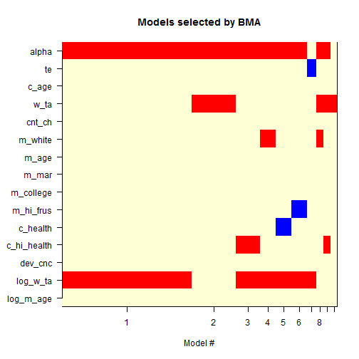
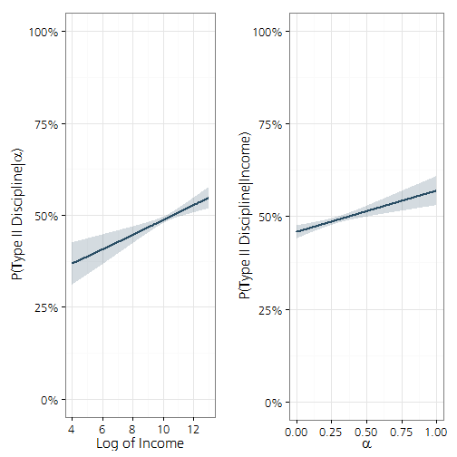

Analysis of Prepared Data
========================================================

Analysis of data prepared in `data_prep*` files.


```r
# clear memory
rm(list = ls(all = TRUE))

setwd("C:/Users/mienkoja/Dropbox/qualpaper")
# setwd('~/Dropbox/qualpaper/')

require(Benchmarking)
```

```
## Loading required package: Benchmarking
## Loading required package: lpSolveAPI
## Loading required package: ucminf
```

```r
require(sqldf)
```

```
## Loading required package: sqldf
## Loading required package: DBI
## Loading required package: gsubfn
## Loading required package: proto
## Loading required namespace: tcltk
## Loading required package: chron
## Loading required package: RSQLite
## Loading required package: RSQLite.extfuns
```

```r
require(BMA)
```

```
## Loading required package: BMA
```

```
## Warning: package 'BMA' was built under R version 3.0.3
```

```
## Loading required package: survival
## Loading required package: splines
## Loading required package: leaps
## Loading required package: robustbase
```

```
## Warning: package 'robustbase' was built under R version 3.0.3
```

```
## 
## Attaching package: 'robustbase'
## 
## The following object is masked from 'package:survival':
## 
##     heart
```

```r
require(Amelia)  # generate multiple imputations
```

```
## Loading required package: Amelia
```

```
## Warning: package 'Amelia' was built under R version 3.0.3
```

```
## Loading required package: foreign
## Loading required package: Rcpp
## Loading required package: RcppArmadillo
## ## 
## ## Amelia II: Multiple Imputation
## ## (Version 1.7.2, built: 2013-04-03)
## ## Copyright (C) 2005-2014 James Honaker, Gary King and Matthew Blackwell
## ## Refer to http://gking.harvard.edu/amelia/ for more information
## ##
```

```r
require(mitools)  # for MIextract()
```

```
## Loading required package: mitools
```

```
## Warning: package 'mitools' was built under R version 3.0.3
```

```r
require(mix)  # for mi.inference()
```

```
## Loading required package: mix
```

```r
require(ggplot2)
```

```
## Loading required package: ggplot2
```

```r
require(extrafont)
```

```
## Loading required package: extrafont
```

```
## Warning: package 'extrafont' was built under R version 3.0.3
```

```
## Registering fonts with R
```

```r
require(pocr)
```

```
## Loading required package: pocr
## Loading required package: RODBC
## Loading required package: reshape2
## Loading required package: plyr
## Loading required package: stringr
## Loading required package: scales
## Loading required package: lubridate
## 
## Attaching package: 'lubridate'
## 
## The following object is masked from 'package:plyr':
## 
##     here
## 
## The following objects are masked from 'package:chron':
## 
##     days, hours, minutes, seconds, years
## 
## Loading required package: RColorBrewer
## Loading required package: gridExtra
## Loading required package: grid
## Loading required package: brew
```

```r
require(gridExtra)


set.seed(123456)

# load('~/Dropbox/qualpaper/sech_out.RData')
load("C:/Users/mienkoja/Dropbox/qualpaper/sech_out.RData")
```


Calculate Technical Efficiency
-------------------------


```r
# see page 215 from Bogetoft and Otto 2011
sfa_dat <- as.data.frame(na.omit(with(r_dat, cbind(id
                                                   ,w_ta=w_ta*alpha
                                                   ,t_ta=t_ta*alpha
                                                   ,t_tvc
                                                   ,x_c)
                                      )
                                 )
                         )

sfa_dat <- subset(sfa_dat, (is.infinite(sfa_dat$w_ta)==FALSE | is.infinite(sfa_dat$t_ta==FALSE)
                             )
                  )
sfa_dat <- subset(sfa_dat, !(sfa_dat$w_ta==0 & sfa_dat$t_ta==0))

x <- with(sfa_dat, cbind(w_ta, t_ta)) 
y1 <- matrix(sfa_dat$t_tvc)
y2 <- matrix(sfa_dat$x_c)

t_tvc_sfa <- sfa(log1p(x), log1p(y1))

summary(t_tvc_sfa)
```

```
##             Parameters   Std.err   t-value  Pr(>|t|)
## (Intercept)     2.1687   0.22175     9.780         0
## xw_ta           0.6029   0.01534    39.304         0
## xt_ta           0.2929   0.03323     8.814         0
## lambda          1.8977   0.17427    10.889         0
## sigma2         0.91209 
## sigma2v =  0.1982 ;  sigma2u =  0.7139 
## log likelihood =  -1845 
## Convergence =  4
```

```r

#percentage of inefficiency variation to total variation
lambda <- lambda.sfa(t_tvc_sfa)
100*lambda^2/(1+lambda^2)
```

```
## lambda 
##  78.27
```

```r

#variance for inefficiency
sigma2u.sfa(t_tvc_sfa)
```

```
## sigma2u 
##  0.7139
```

```r

#variance for random errors
sigma2v.sfa(t_tvc_sfa)
```

```
## sigma2v 
##  0.1982
```

```r

#residuals
e <- residuals(t_tvc_sfa)

#sigma 2
s2 <- sigma2.sfa(t_tvc_sfa)

mustar <- -e*lambda^2/(1+lambda^2)
sstar <- lambda/(1+lambda^2)*sqrt(s2)
tej <- exp(-mustar-sstar*(dnorm(mustar/sstar)/pnorm(mustar/sstar)))
tejt <- data.frame(id=sfa_dat$id, tejt=tej[1:1822])
#tejt <- data.frame(id=sfa_dat$id, tejt=tej[1:927])

r_dat <- sqldf("select 
                  r.*
                  ,tejt
                from r_dat r
                left join tejt tt
                  on r.id=tt.id")
```

```
## Loading required package: tcltk
```

```r

#try benchmarking for x_c
x_c_sfa <- sfa(log1p(x), log1p(y2))

summary(x_c_sfa)
```

```
##             Parameters   Std.err   t-value  Pr(>|t|)
## (Intercept)    -0.9361   0.49008    -1.910     0.056
## xw_ta           0.4531   0.03846    11.782     0.000
## xt_ta           0.7740   0.06036    12.823     0.000
## lambda         15.7237   1.77531     8.857     0.000
## sigma2         32.269 
## sigma2v =  0.13 ;  sigma2u =  32.14 
## log likelihood =  -4571 
## Convergence =  4
```

```r

#percentage of inefficiency variation to total variation
lambda <- lambda.sfa(x_c_sfa)
100*lambda^2/(1+lambda^2)
```

```
## lambda 
##   99.6
```

```r

#variance for inefficiency
sigma2u.sfa(x_c_sfa)
```

```
## sigma2u 
##   32.14
```

```r

#variance for random errors
sigma2v.sfa(x_c_sfa)
```

```
## sigma2v 
##    0.13
```

```r

#residuals
e <- residuals(x_c_sfa)

#sigma 2
s2 <- sigma2.sfa(x_c_sfa)

mustar <- -e*lambda^2/(1+lambda^2)
sstar <- lambda/(1+lambda^2)*sqrt(s2)
tej <- exp(-mustar-sstar*(dnorm(mustar/sstar)/pnorm(mustar/sstar)))
#tejx <- data.frame(id=sfa_dat$id, tejx=tej[1:927])
tejx <- data.frame(id=sfa_dat$id, tejx=tej[1:1822])


r_dat <- sqldf("select 
               r.*
               ,tejx
               from r_dat r
               left join tejx tx
               on r.id=tx.id")

X <- with(sfa_dat, cbind(w_ta = w_ta/t_ta, t_tvc, x_c))
Y <- matrix(sfa_dat$t_ta, ncol=1)
dist <- sfa(log1p(X), -log(Y))
tedist <- te.sfa(dist)
sigma2u <- sigma2u.sfa(dist)
sigma2v <- sigma2v.sfa(dist)

te <- data.frame(id=sfa_dat$id, te=tedist)

# commented code is to possibly model te as a hyper parameter
#nsim <- 10
#nobs <- 1823

#te <- data.frame(id=rep(sfa_dat$id, nsim), te=rep(tedist, nsim))
#err <- rep(NA, nsim*nobs)
#err <- rnorm(1, mean=0, sd=sigma2v)-rnorm(1, mean=0, sd=sigma2u), nsim*nobs)
# for (i in 1:(nsim*nobs)){
#     err[i] <- rnorm(1, mean=0, sd=sigma2v)-rnorm(1, mean=0, sd=sigma2u)  
# }
# te$err <- err
# te$te_sim <- te$te + te$err
# 
# idx <- data.frame(j=rep(seq(1:nobs), nsim), i = rep(seq(1:nsim), nobs), tot = seq(1:(nsim*nobs)))
# 
# m <- lm(tot~j+i, dat=idx)

r_dat <- sqldf("select 
               r.*
               ,te
               from r_dat r
               left join te te
               on r.id=te.id")
```


Run a BMA to Select Variables 
-------------------------

This section of the code does a little prep work and then conducts a BMA to identify the model with the highest posterior probability. 


```r
r_dat_sub <- subset(r_dat
                    ,r_dat$c_age > 18
                    ,select = c(neg_count
                                ,pos_count
                                ,alpha 
                                ,te 
                                ,c_age
                                ,w_ta
                                ,cnt_ch
                                ,m_white
                                ,m_age
                                ,m_mar
                                ,m_college 
                                ,m_hi_frus 
                                ,c_health
                                ,c_hi_health                    
                                ,dev_cnc)
)

#transform some variables
r_dat_sub$te <- as.numeric(r_dat_sub$te)
r_dat_sub$log_w_ta <- log(r_dat_sub$w_ta)     
r_dat_sub$log_m_age <- log(r_dat_sub$m_age)
r_dat_sub$log_c_age <- log(r_dat_sub$c_age)
#final calculation for p_all_neg
r_dat_sub$p_all_neg <- (r_dat_sub$neg_count/2)/((r_dat_sub$neg_count/2)+(r_dat_sub$pos_count/3))
r_dat_sub$p_all_neg_d <- ((r_dat_sub$neg_count/2)+(r_dat_sub$pos_count/3))

#calculate some interactions
r_dat_sub$alpha_by_log_w_ta <- r_dat_sub$alpha*log(r_dat_sub$w_ta)     
r_dat_sub$te_by_log_w_ta <- r_dat_sub$te*log(r_dat_sub$w_ta)
r_dat_sub$alpha_by_te <- r_dat_sub$te*r_dat_sub$alpha
r_dat_sub$alpha_by_log_w_ta_by_te <- r_dat_sub$te*log(r_dat_sub$w_ta)*r_dat_sub$alpha

x=subset(r_dat_sub, select=c(alpha
                             ,te 
                             ,c_age
                             ,w_ta
                             ,cnt_ch
                             ,m_white
                             ,m_age
                             ,m_mar
                             ,m_college 
                             ,m_hi_frus 
                             ,c_health
                             ,c_hi_health                    
                             ,dev_cnc
                             ,log_w_ta  
                             ,log_m_age))

glm.out.p_all_neg <- bic.glm(y=r_dat_sub$p_all_neg
                             ,x=x
                             ,data = r_dat_sub
                             ,glm.family = quasibinomial()
                             ,wt=r_dat_sub$p_all_neg_d
) 
```

```
## Warning: There were  129 records deleted due to NA's
## Warning: longer object length is not a multiple of shorter object length
## Warning: 1 rows with zero wts not counted
```

```r

summary(glm.out.p_all_neg)
```

```
## 
## Call:
## bic.glm.data.frame(x = x, y = r_dat_sub$p_all_neg, glm.family = quasibinomial(),     wt = r_dat_sub$p_all_neg_d, data = r_dat_sub)
## 
## 
##   10  models were selected
##  Best  5  models (cumulative posterior probability =  0.834 ): 
## 
##              p!=0   EV        SD        model 1    model 2    model 3  
## Intercept    100   -7.91e-01  3.89e-01  -1.00e+00  -2.32e-01  -1.03e+00
## alpha        94.1   4.04e-01  1.57e-01   4.43e-01   3.90e-01   4.37e-01
## te            3.5  -1.42e-02  7.98e-02      .          .          .    
## c_age         0.0   0.00e+00  0.00e+00      .          .          .    
## w_ta         23.6   4.88e-07  9.32e-07      .       2.15e-06      .    
## cnt_ch        0.0   0.00e+00  0.00e+00      .          .          .    
## m_white       8.5   5.68e-03  2.21e-02      .          .          .    
## m_age         0.0   0.00e+00  0.00e+00      .          .          .    
## m_mar         0.0   0.00e+00  0.00e+00      .          .          .    
## m_college     0.0   0.00e+00  0.00e+00      .          .          .    
## m_hi_frus     5.5  -3.38e-03  1.67e-02      .          .          .    
## c_health      5.7  -2.11e-03  1.02e-02      .          .          .    
## c_hi_health  11.2   1.04e-02  3.39e-02      .          .       9.34e-02
## dev_cnc       0.0   0.00e+00  0.00e+00      .          .          .    
## log_w_ta     76.4   6.10e-02  3.91e-02   8.22e-02      .       7.74e-02
## log_m_age     0.0   0.00e+00  0.00e+00      .          .          .    
##                                                                        
## nVar                                       2          2          3     
## BIC                                     -4.69e+03  -4.69e+03  -4.69e+03
## post prob                                0.472      0.160      0.086   
##              model 4    model 5  
## Intercept    -9.34e-01  -8.93e-01
## alpha         4.32e-01   4.42e-01
## te               .          .    
## c_age            .          .    
## w_ta             .          .    
## cnt_ch           .          .    
## m_white       6.49e-02      .    
## m_age            .          .    
## m_mar            .          .    
## m_college        .          .    
## m_hi_frus        .          .    
## c_health         .      -3.69e-02
## c_hi_health      .          .    
## dev_cnc          .          .    
## log_w_ta      7.23e-02   7.78e-02
## log_m_age        .          .    
##                                  
## nVar            3          3     
## BIC          -4.69e+03  -4.69e+03
## post prob     0.059      0.057
```

```r
imageplot.bma(glm.out.p_all_neg)
```

 


Run MI to Make up for Missing Data
-------------------------
I will ultimately run an MI to account for some of the missing values in my data (about 10 percent of alpha values). I should ultimately work out a way to integrate the multiple imputation into the BMA above. This should be fairly straight-forward but will probably take an hour or two to implement. At the time of this writing, my implementation of `Amelia`. Having run the model previously, however, I can confirm that the results do not change from those of the binomial GLM below.  


```r
# r_dat_sub.amelia <- amelia(r_dat_sub ,m=10 ,noms=c('m_white' ,'m_mar'
# ,'m_college' ,'m_hi_frus' ,'c_hi_health' ,'dev_cnc') ,emburn=c(500,500))

```


Run Most Probable Model from BMA
-------------------------
I include the technical efficiency variable, `te`, as well due to a desire to test the original hypothesis of the paper. As suggested by the BMA, however, `te` is not a significant predictor in the model. 


```r
m1 <- glm(p_all_neg ~ alpha +
                 log_w_ta
                 ,family=quasibinomial
                 ,weights=r_dat_sub$p_all_neg_d
                 ,data=r_dat_sub)
summary(m1)
```

```
## 
## Call:
## glm(formula = p_all_neg ~ alpha + log_w_ta, family = quasibinomial, 
##     data = r_dat_sub, weights = r_dat_sub$p_all_neg_d)
## 
## Deviance Residuals: 
##     Min       1Q   Median       3Q      Max  
## -1.2485  -0.1164   0.0208   0.1813   0.8587  
## 
## Coefficients:
##             Estimate Std. Error t value Pr(>|t|)    
## (Intercept)  -0.9869     0.2156   -4.58  5.4e-06 ***
## alpha         0.4488     0.1115    4.02  6.2e-05 ***
## log_w_ta      0.0807     0.0201    4.02  6.2e-05 ***
## ---
## Signif. codes:  0 '***' 0.001 '**' 0.01 '*' 0.05 '.' 0.1 ' ' 1
## 
## (Dispersion parameter for quasibinomial family taken to be 0.1097)
## 
##     Null deviance: 117.97  on 855  degrees of freedom
## Residual deviance: 115.18  on 853  degrees of freedom
##   (106 observations deleted due to missingness)
## AIC: NA
## 
## Number of Fisher Scoring iterations: 3
```

```r

sim_dat <- subset(r_dat_sub, select=c(alpha, log_w_ta))

sim_dat_w1 <- with(sim_dat
                 ,data.frame(alpha = mean(sim_dat$alpha, na.rm=TRUE)
                             ,log_w_ta = rep(seq(from = 4, to = 13, length.out = 1000))
                             )
                 )

sim_dat_w2 <- cbind(sim_dat_w1
                    ,predict(m1, type="response", newdata=sim_dat_w1, se = TRUE))

sim_dat_w3 <- within(sim_dat_w2, {
    LL <- fit - (1.96 * se.fit)
    UL <- fit + (1.96 * se.fit)
})

sim_dat_a1 <- with(sim_dat
                 ,data.frame(log_w_ta = mean(sim_dat$log_w_ta, na.rm=TRUE)
                             ,alpha = rep(seq(from = 0, to = 1, length.out = 1000))
                             )
                 )

sim_dat_a2 <- cbind(sim_dat_a1
                    ,predict(m1, type="response", newdata=sim_dat_a1, se = TRUE))

sim_dat_a3 <- within(sim_dat_a2, {
    LL <- fit - (1.96 * se.fit)
    UL <- fit + (1.96 * se.fit)
})

breaks=c(.40, .45, .50, .55, .60)


w_p <- ggplot(sim_dat_w3, aes(x = log_w_ta, y = fit)) + 
        geom_ribbon(aes(ymin = LL, ymax = UL),alpha = 0.2, fill="#294d64") + 
        geom_line(size = 1, colour="#294d64") +
        xlab("Log of Income") +
        ylab(expression(paste("P(Type II Discipline|", alpha, ")"))) +
        scale_y_continuous(labels = percent
                           #,breaks=breaks
                           ,limits=c(0, 1)) +
        theme_bw() +
        theme(text=element_text(size=16, family="Frutiger LT Std 45 Light"))

a_p <- ggplot(sim_dat_a3, aes(x = alpha, y = fit)) + 
        geom_ribbon(aes(ymin = LL, ymax = UL),alpha = 0.2, fill="#294d64") + 
        geom_line(size = 1, colour="#294d64") +
        xlab(expression(alpha)) +
        ylab("P(Type II Discipline|Income)") +
        scale_y_continuous(labels = percent
                           #,breaks=breaks
                           ,limits=c(0, 1)) +
        theme_bw() +
        theme(text=element_text(size=16, family="Frutiger LT Std 45 Light"))

png(file="C:/Users/mienkoja/Dropbox/qualpaper/model_plot.png", width=15, height = 12, units="in", res = 640)
grid.arrange(w_p, a_p, ncol=2)
dev.off()
```

```
## pdf 
##   2
```

```r
grid.arrange(w_p, a_p, ncol=2)
```

```
## Warning: unknown AFM entity encountered
## Warning: unknown AFM entity encountered
## Warning: unknown AFM entity encountered
## Warning: unknown AFM entity encountered
```

 

