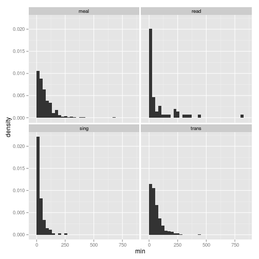

Get Time Use Estimates from ATUS and Calculate Income Distribution
========================================================
This document outlines the definition of several distributions used to smooth ordinal estimates of various continuous variables in the Early Childhood Survey. As with the CES code, this is the script used here is a hack of the scripts written by [ajdamico](https://github.com/ajdamico/usgsd/tree/master/American%20Time%20Use%20Survey) and available for use the following [link](https://github.com/ajdamico/usgsd/tree/master/American%20Time%20Use%20Survey). The files were downloaded using scripts in that repo and the directories identified in the following scripts assume that the user has a directory structure that matches those resulting from the [ajdamico](https://github.com/ajdamico/usgsd/tree/master/American%20Time%20Use%20Survey) download scripts.   

Preliminary Steps
-------------------------

The following code clears our memory, sets our working directory (as created by the [ajdamico](https://github.com/ajdamico/usgsd/tree/master/Consumer%20Expenditure%20Survey) scripts), sets a random seed to facilitate replication, and loads some libraries that are required for these initial steps. 


```r
# clear memory
rm(list = ls(all = TRUE))

# setwd('C:/Users/mienkoja/Dropbox/qp_analysis/ATUS/2003')
setwd("~/Dropbox/qualpaper/ATUS/2003")

require(ggplot2)
```

```
## Loading required package: ggplot2
```

```r
require(sqldf)  # load the sqldf package (enables sql queries on data frames)
```

```
## Loading required package: sqldf
## Loading required package: gsubfn
## Loading required package: proto
## Loading required namespace: tcltk
## Loading required package: RSQLite
## Loading required package: DBI
## Loading required package: RSQLite.extfuns
```

```r
require(MASS)  #for fitdistr
```

```
## Loading required package: MASS
```

```r
require(Rlab)  #for rbern
```

```
## Loading required package: Rlab
## Rlab 2.15.1 attached.
## 
## 
## Attaching package: 'Rlab'
## 
## The following object is masked from 'package:MASS':
## 
##     michelson
## 
## The following objects are masked from 'package:stats':
## 
##     dexp, dgamma, dweibull, pexp, pgamma, pweibull, qexp, qgamma,
##     qweibull, rexp, rgamma, rweibull
## 
## The following object is masked from 'package:datasets':
## 
##     precip
```

```r

set.seed(123456)
```


Read in All Data
-------------------------
This chunk of code reads in all of the required data from the summary (`atussum.rda`) and roster (`atusrost.rda`) files. The data are filtered to just look at households with a child 3 or below and only looking at females for congruence with the NSECH sample. We select all respondents first to inspect distribution and then select seperate extracts for employed, unemployed, and non-in-labor forces (i.e. other) subjects.


```r
# load the roster file
load("atusrost.rda")

# load the activity summary file
load("atussum.rda")

atussum <- sqldf("select *
                 from atussum a
                 join (select distinct 
                 tucaseid 
                 from atusrost 
                 where teage <= 3) b
                 on a.tucaseid = b.tucaseid
                 where tesex = 2")
save.image("~/Dropbox/qualpaper/smooth.RData")
```


Note that as with the CES data, we have the `save.image()` at the end of the previous chunk. I am not currently evaluating this chunk when I compile my markdown to HTML. The code runs fine outside of knitr, but knitr has a yet undiagnosed problem in trying to load the compressed data files. Once this problem is fixed, the following chunk will be unecessary.  


```r
load("~/Dropbox/qualpaper/smooth.RData")
```


```r
# count of observations
obs <- length(atussum$tucaseid)

# vector of reading activities
atus_read <- atussum$t030301

# vector of talking activities (closest activity to singing - includes
# singing according to ATUS)
atus_sing <- atussum$t030106

# vector of transportation activities
atus_trans <- atussum$t170301 + atussum$t030112 + atussum$t030110

# vector of meal prep and eating activities
atus_meal <- atussum$t020102
```


Examine the Distributions
-------------------------
All of the distributions are zero-inflated so we focus just on the non-zero portions to determine our likely distribution.


```r
# create a data frame for plotting in ggplot
min <- c(atus_read, atus_sing, atus_trans, atus_meal)
act_type <- c(rep("read", obs), rep("sing", obs), rep("trans", obs), rep("meal", 
    obs))
dat_act <- data.frame(min = min, act_type = act_type)

# all distributions are zero-inflated.  look at just the non-zero portions
# to determine our likely distribution
dat_act <- subset(dat_act, dat_act$min > 0)

# plot all four distributions exponential is probably not perfect, but is
# not unreasonable
ggplot(dat_act, aes(x = min, y = ..density..)) + geom_histogram() + facet_wrap(~act_type)
```

```
## stat_bin: binwidth defaulted to range/30. Use 'binwidth = x' to adjust this.
## stat_bin: binwidth defaulted to range/30. Use 'binwidth = x' to adjust this.
## stat_bin: binwidth defaulted to range/30. Use 'binwidth = x' to adjust this.
## stat_bin: binwidth defaulted to range/30. Use 'binwidth = x' to adjust this.
```

 


A plot of the four distributions reveals a strong positive skew. The exponential is probably not a perfect fit for these data, but it is not unreasonable.

Write a Zero-Inflated Exponential Fitting and Sampling Function
-------------------------
Next we write a function to fit ATUS data to an exponential by MLE and then create a zero-inflated exponential "prior" for each activity. This function receives a vector of zero and non-zero time values for a given activity. Specifically, `x` is the vector and `n` is the number of values you want returned. This function could be improved at some point by allowing the user to specify their own p and n (i.e. don't use an x vector).


```r
ziexp_prior <- function(x, n) {
    # create a vector of people who perform the given activity (i.e. a non-zero
    # (nz) vector)
    x_nz <- x[x > 0]
    
    # calculate rate parameter with fitdistr
    param <- fitdistr(x_nz, "exponential")
    
    # specify a zi sampling function calculate emperical p for the bern portion
    p <- (length(x) - length(x_nz))/length(x)
    
    # simulate all values using the param estimate from above
    prior <- rep(NA, n)
    for (i in 1:n) {
        prior[i] <- ifelse(rbern(n = 1, p = p) == 1, 0, rexp(n = 1, param$estimate[1]))
    }
    # return results
    return(prior)
}
```


Breakout Employment Categories
-------------------------
As indicated above, we now break out the sample for each employment category. This breakout is made due to the possibility of differences in the parenting time distributions of women at various levels of employment. 


```r
#select employed
atussum_emp <- sqldf("select * 
                     from atussum
                     where telfs in (1,2)")
```

```
## Loading required package: tcltk
```

```r

#vector of reading activities
atus_read_emp <- atussum_emp$t030301

#vector of talking activities (closest activity to singing - includes singing according to ATUS)
atus_sing_emp <- atussum_emp$t030106

#vector of transportation activities
atus_trans_emp <- atussum_emp$t170301 + atussum_emp$t030112 + atussum_emp$t030110

#vector of meal prep and eating activities
atus_meal_emp <- atussum_emp$t020102

#select unemployed
atussum_unemp <- sqldf("select * 
                       from atussum
                       where telfs in (3,4)")

#vector of reading activities
atus_read_unemp <- atussum_unemp$t030301

#vector of talking activities (closest activity to singing - includes singing according to ATUS)
atus_sing_unemp <- atussum_unemp$t030106

#vector of transportation activities
atus_trans_unemp <- atussum_unemp$t170301 + atussum_unemp$t030112 + atussum_unemp$t030110

#vector of meal prep and eating activities
atus_meal_unemp <- atussum_unemp$t020102

#select "other" employment status
atussum_other <- sqldf("select * 
                       from atussum
                       where telfs in (5)")

#vector of reading activities
atus_read_other <- atussum_other$t030301

#vector of talking activities (closest activity to singing - includes singing according to ATUS)
atus_sing_other <- atussum_other$t030106

#vector of transportation activities
atus_trans_other <- atussum_other$t170301 + atussum_other$t030112 + atussum_other$t030110

#vector of meal prep and eating activities
atus_meal_other <- atussum_other$t020102
```


Create Sampling Vectors
-------------------------
We now create sampling vectors for each employment category using the `ziexp_prior()` function identified above. 


```r
read_prior_emp <- ziexp_prior(atus_read_emp, 1e+05)
sing_prior_emp <- ziexp_prior(atus_sing_emp, 1e+05)
trans_prior_emp <- ziexp_prior(atus_trans_emp, 1e+05)
meal_prior_emp <- ziexp_prior(atus_meal_emp, 1e+05)

read_prior_unemp <- ziexp_prior(atus_read_unemp, 1e+05)
sing_prior_unemp <- ziexp_prior(atus_sing_unemp, 1e+05)
trans_prior_unemp <- ziexp_prior(atus_trans_unemp, 1e+05)
meal_prior_unemp <- ziexp_prior(atus_meal_unemp, 1e+05)

read_prior_other <- ziexp_prior(atus_read_other, 1e+05)
sing_prior_other <- ziexp_prior(atus_sing_other, 1e+05)
trans_prior_other <- ziexp_prior(atus_trans_other, 1e+05)
meal_prior_other <- ziexp_prior(atus_meal_other, 1e+05)
```


Create Sampling Vectors for Income
-------------------------

There are no established, peer-reviewed sources of activity distributions (at least not for the activities above). As such, we defined our own exponential distributions as noted above. This is not the case for income. For income, there is a rich set of literature which seeks to identify good distributions to describe personal income in the US. Bandourian, McDonald, and Turley (2002) compare several distributions for a variety of different countries. Weibull is not the best fitting for US data but is identified by the authors as one of the best fitting over all of the examined distributions and is chosen here for its simplicity and relative familiarity to the target audience of this paper. I use the parameter estimates from Bandourian, et al. for the draw from the Weibull. Bandouria, et al. were using 1994 data for their distribution. As such, I inflation adjust the measures (using the recommended BLS multiplier).


```r
inc_prior <- rweibull(1e+05, 1.3, 50287) * 1.16
```


Run Monte Carlo Simulations to Draw Work Hours
-------------------------
In the following code I run Monte Carlo simulations from which I can sample to get an estimate of work hours for individuals in our survey. This is somewhat less sophisticated than the approach I am taking for time spent, in child-caring activities. However, there is much less variability in these numbers (e.g. most full-time employees work aroung 40 hours) and it is still a preferred approach to simplying multiplying the employment categories by a scalar. Doing something similar to what we have done for the child-caring activities may be preferred to this and should be explored at some point. 


```r

mc <- function(low, high, ci = 0.95, n = 10000) {
    mu = mean(c(low, high))
    z = qnorm(1 - (1 - ci)/2)
    s = (high - mu)/z
    rnorm(n, mu, s)
}
```


The first step is to load the relevant ATUS files. After loading the activity (`atusact.rda`) and respondt (`atusresp.rda`) files, we join these files together and subset the data to `atusact`. Our where clause gives us only women (`resex = 5`) who provided some indication of working (`tutier1code = 5`).


```r
# load the roster file
load("atusrost.rda")

# load the activity summary file
load("atusact.rda")

load("atuswgts_all2003.rda")

load("atusresp.rda")

atusact <- sqldf("select 
                    a.tucaseid
                    ,sum(a.tuactdur24) tt_wrk
                    ,b.tufinlwgt
                    ,sum(a.tuactdur24)*b.tufinlwgt tt_wrk_by_wgt
                    ,d.trdpftpt 
                 from atusact a
                 join atusresp b
                    on a.tucaseid = b.tucaseid    
                 join (select distinct 
                        tucaseid 
                      from atusrost 
                      where teage <= 3) c
                    on a.tucaseid = c.tucaseid
                 join atussum d
                    on a.tucaseid = d.tucaseid
                 where tesex = 2
                    and a.tutier1code = 5
                 group by 
                    a.tucaseid
                    ,b.tufinlwgt
                    ,d.trdpftpt")

save.image("~/Dropbox/qualpaper/inc_est.RData")
```


As with other `*.rda` files, we have the `save.image()` at the end of the previous chunk. I am not currently evaluating this chunk when I compile my markdown to HTML. The code runs fine outside of knitr, but knitr has a yet undiagnosed problem in trying to load the compressed data files. Once this problem is fixed, the following chunk will be unecessary.  


```r
load("~/Dropbox/qualpaper/inc_est.RData")
```


Here, I subset `atusact` to seperate full and part time vectors.   


```r
atusact_ft <- subset(atusact, atusact$trdpftpt == 1)
atusact_pt <- subset(atusact, atusact$trdpftpt == 2)
```


Next, we sum the time activity values and divide by 60 (to convert to hours). This is our average daily hours worked for full (`h_f`) and part time (`p_t`) women. I then join this to the weight data and then apply the standard error formula given by the BLS [here](https://docs.google.com/viewer?url=http%3A%2F%2Fwww.bls.gov%2Ftus%2Fatususersguide.pdf). We then calculate upper and lower values for use in the monte carol simulation. 


```r
h_f <- (colSums(atusact_ft)[4]/colSums(atusact_ft)[3])/60
h_p <- (colSums(atusact_pt)[4]/colSums(atusact_pt)[3])/60

finlwgt <- atuswgts_all2003[, c(1, 161:321)]

finwgt_ft <- sqldf("select \n                      tt_wrk\n                      ,fw.* \n                     from finlwgt fw \n                      join atusact_ft af \n                        on fw.tucaseid = af.tucaseid")
```

```
## Loading required package: tcltk
```

```r

finwgt_pt <- sqldf("select \n                      tt_wrk\n                      ,fw.* \n                     from finlwgt fw \n                      join atusact_pt ap \n                        on fw.tucaseid = ap.tucaseid")


h_p_se <- (4/160) * sum(((colSums(finwgt_pt[, 1] * finwgt_pt[, 4:163])/colSums(finwgt_pt[, 
    4:163])/60) - h_p)^2)
h_f_se <- (4/160) * sum(((colSums(finwgt_ft[, 1] * finwgt_ft[, 4:163])/colSums(finwgt_ft[, 
    4:163])/60) - h_f)^2)

upper_h_p <- h_p + h_p_se * qnorm(0.975)
lower_h_p <- h_p - h_p_se * qnorm(0.975)

upper_h_f <- h_f + h_f_se * qnorm(0.975)
lower_h_f <- h_f - h_f_se * qnorm(0.975)
```


The last step of this process is to run the Monte Carlo simulations and assign the results to a vector for each employment type. 


```r
mc_hrs_ft <- mc(lower_h_f, upper_h_f)
mc_hrs_pt <- mc(lower_h_p, upper_h_p)
```


Save Data for Later Analysis 
-------------------------

```r
priors <- c("mc_hrs_ft", "mc_hrs_pt", "read_prior_other", "sing_prior_other", 
    "trans_prior_other", "meal_prior_other", "meal_prior_unemp", "trans_prior_unemp", 
    "sing_prior_unemp", "read_prior_unemp", "meal_prior_emp", "trans_prior_emp", 
    "sing_prior_emp", "read_prior_emp", "inc_prior")

rm(list = setdiff(ls(), priors))
save.image("~/Dropbox/qualpaper/atus_out.RData")
```

