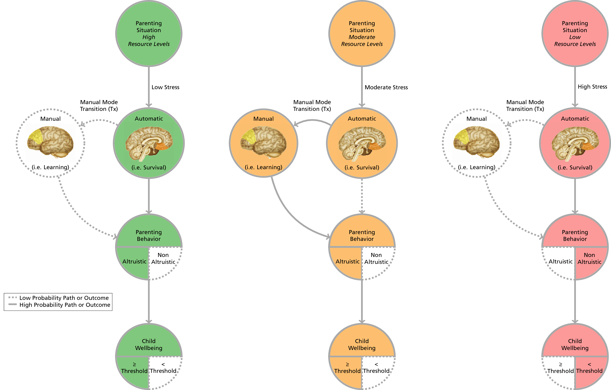

This is an R Markdown document. Markdown is a simple formatting syntax for authoring HTML, PDF, and MS Word documents. For more details on using R Markdown see <http://rmarkdown.rstudio.com>.

When you click the **Knit** button a document will be generated that includes both content as well as the output of any embedded R code chunks within the document. You can embed an R code chunk like this:

```{r, echo=FALSE, warning=FALSE, message=FALSE, error=FALSE}
require(knitr)
source("tmd.R")
require(Hmisc)
opts_chunk$set(echo = FALSE
               ,warning=FALSE
               ,results='asis'
               ,message=FALSE
               ,error=FALSE
               ,dpi = 400)

k <- .65

textopdf <- FALSE
```


```{r, fig.width=10.5*k, fig.height=8.5*k, eval=FALSE}
require(png)
img <- "general_conceptual_model_flow.png"
img <- readPNG(img)
plot(1:2, type='n', main="Plotting Over an Image", xlab="x", ylab="y")
lim <- par()
rasterImage(img, lim$usr[1], lim$usr[3], lim$usr[2], lim$usr[4])
tmd(code = "general_conceptual_model_flow.Rnw")
```
\includepdf[scale=0.8,pages={1}]{general_conceptual_model_flow.pdf}


```{r, fig.width=3, fig.height=3, eval=FALSE}
tmd(code = "general_conceptual_model_graphs.Rnw", k2p = FALSE)
```


```{r, fig.width=1.1, fig.height=1.1}
x <- c(.5, 1.5, 4.5)
y <- c(4.5, 1.5, .5)
wb1 <- data.frame(bezier(x, y, evaluation = 500))
wb2 <- data.frame(bezier(x+.5, y+.5, evaluation = 500))
wb3 <- data.frame(bezier(x+1, y+1, evaluation = 500))

write.table(wb1, 'wb1.dat',sep='\t', quote=F, col.names=F, row.names=F)
write.table(wb2, 'wb2.dat',sep='\t', quote=F, col.names=F, row.names=F)
write.table(wb3, 'wb3.dat',sep='\t', quote=F, col.names=F, row.names=F)
tmd(code = "basic_utility.Rnw", k2p = FALSE, pdf_opts = "scale=0.333, pages={1}")
```

```{r, fig.width=1.925, fig.height=1.925}
y <- c(0, 3.9, 3.9)
x <- c(3.9, 3.9, 0)
ppf1 <- data.frame(bezier(x, y, evaluation = 500))
ppf2 <- ppf1*1.4
write.table(ppf1, 'ppf1.dat',sep='\t', quote=F, col.names=F, row.names=F)
write.table(ppf2, 'ppf2.dat',sep='\t', quote=F, col.names=F, row.names=F)
tmd(code = "wellbeing_production_possibilities.Rnw", k2p = FALSE, pdf_opts = "scale=0.333, pages={1}")
```


```{r, fig.width=1.71, fig.height=1.71}
x <- c(.625, 1.75, 4.5)
y <- c(4.5, 1.75, .625)
util1 <- data.frame(bezier(x, y, evaluation = 500))
util1 <- data.frame(util1$y, util1$x)
write.table(util1, 'util1.dat',sep='\t', quote=F, col.names=F, row.names=F, )
tmd(code = "comparative_advantage.Rnw", k2p = FALSE, pdf_opts = "scale=0.333, pages={1}")
```


