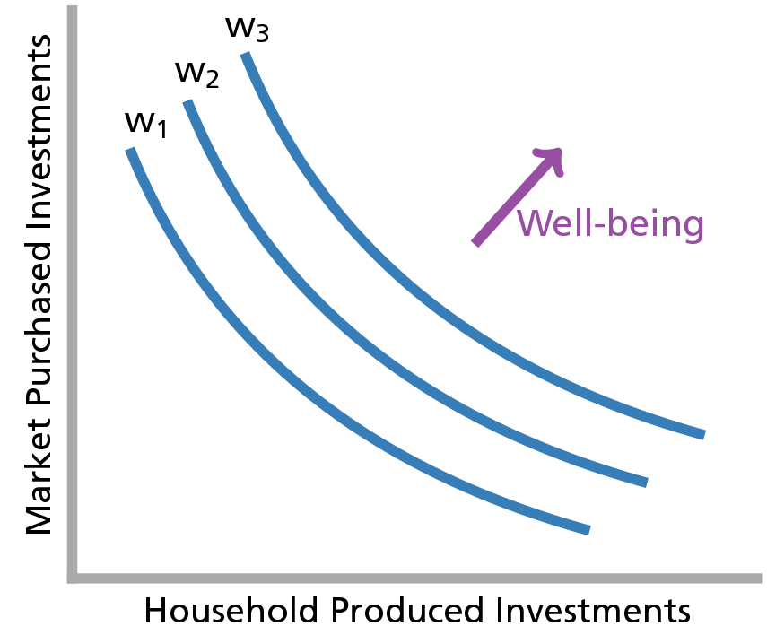
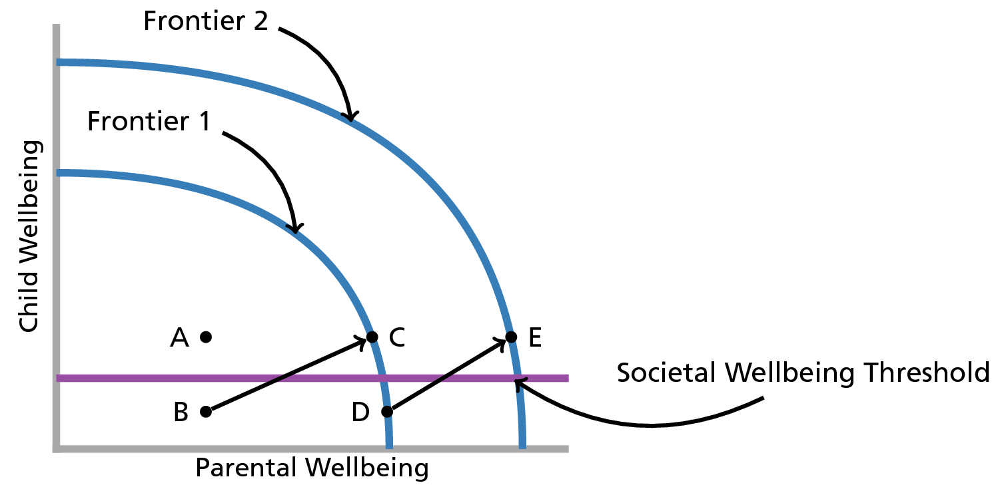

```{r, echo=FALSE, warning=FALSE, message=FALSE, error=FALSE}
require(knitr)
source("tex_convert.R")
require(Hmisc)
require(RColorBrewer)
require(Benchmarking)
require(sqldf)
require(BMA)
#require(Amelia) # generate multiple imputations
require(mitools) # for MIextract()
require(mix) # for mi.inference()
require(ggplot2)
#require(extrafont)
require(pocr)
require(gridExtra)
require(plyr)
require(xtable)
require(knitcitations)
biblio <- read.bib("qualpaper.bib")

cols <- brewer.pal(8,"Set1")
opts_chunk$set(echo = FALSE
               ,warning=FALSE
               ,results='asis'
               ,message=FALSE
               ,error=FALSE
               ,dpi = 400)
```

# Introduction and Background

The purpose of this paper is to formally specify a general theory of child maltreatment. The conclusion of this paper is that child maltreatment is inextricably linked to resource constraints. As such, we tend to see a relationship between a parent's tendency to maltreat her child and the parent's relative position in the wealth distribution of a given society. Specifically, a parent on the lower end of a wealth distribution will tend to exhibit an increased probability of maltreating her child relative to parents at the higher end of a wealth distribution. The central thesis of this paper is that maltreatment is the normal consequence of parenting decisions made under household resource constraints. While child maltreatment may be undesirable, in most cases it is not pathological. Recognition of this basic distinction has important implications for child welfare policy and practice. 

The basic relationship between wealth and child maltreatment is well-established in child welfare literature with previous studies establishing links between resource constraints and substantiated allegations of child maltreatment as well as general involvement with the child welfare system [@Gil1970; @Pelton1981; @Pelton1994; @Russell1984; @Sedlak1996; @Stith2009; @BergerAndWoldfogel2004]. Studies examining administrative data sets of low-income populations (e.g. TANF recipients) have also shown that exogenous resource-decreasing shocks such as welfare-reform [@Courtney2005] or welfare sanctions [@Slack2007] will tend to increase a family's probability of child welfare system involvement. Other studies have exploited experimental income support programs to address income endogeneity problems inherent in other studies and still find an inverse relationship between family income and the probability of child maltreatment [@Cancian2013; @Fein2003]. While there is a paucity of research examining connections between income and child maltreatment outside of the US [@Cameron2006], the evidence from the US seems to suggest a strong and reliable relationship between child welfare system involvement and resource constraints. 

While the literature provides multiple examples of research establishing a link between resources constraints and child maltreatment, the field is lacking in attempts to formally specify a mechanism to explain this relationship. Two exceptions to this rule include [@Brandon1999] and [@Brandon2001]. In each of these studies, microeconomic models are proposed which outline the manner in which parental resource constraints can lead to maltreatment. The former study suggests that maltreatment is mainly effected by a parent's level of altruism, the latter suggests that maltreatment is a function of how efficiently a parent uses her available resources. Both effects would be subject to income constraints. In this paper, I propose a variation on the models proposed by [@Brandon1999] and [@Brandon2001] followed by an attempt to test key predictions of the model^[Students of social welfare may initially be taken back by the use of economic models to understand the phenomenon of child maltreatment. Historically, social welfare scholars and other non-economic social scientists have tended to approach theory development as a means of organizing broad constructs or ideas to explain experimental or survey data sources. Economists, on the the other hand, have tended to view theory development as a process analogous to theory development in the physical sciences. As such, in much the same way that an astrophysicist seeks to explain the motion of the planets through mathematical equations, economists have tended to rely on a large body of established mathematical theory in order to explain interactions between humans. While the current paper will not rely heavily on formal mathematical theory, I will show how the conclusions and major concepts of economic theory are still relevant and applicable to the current problem.]. Before describing this model in detail, I will begin by a brief overview of theory from human ethology and neuroscience which serves as first principles for the model proposed in this paper.  

## Human Ethology - Why do Humans Engage in Parenting Activities?

While a full review of the nature vs. nurture debate is beyond the scope of this analysis, this paper proceeds from an assumption that human beings are simultaenously biological *and* social beings [see for example @Plomin1994; @Ridley2003]. In other words, human beings are not born as a *tabula rasa*. We come pre-wired to engaged in certain activities such as learning languages, consuming nutrients, and engaging in bipedal locomotion. These activities are certainly moderated by the environment in which a human finds himself, but there is no doubt that our genetic makeup helps us to engage in these activities regardless of our environmental circumstances. Basic evolutionary theory shows us that such behaviors exist *because* they helped our genes to evolve to their present state. 

One type of behavior that enabled our genes to survive is parenting behavior and parental altruism in particular. As described in such seminal works as @Hamilton1964 and @Trivers1974, parental altruism can be defined as those behaviors requiring the investment of time or other resources in a child in a way that benefits the child (in terms of her fitness as a future mate) but comes at a cost to the parent (in terms of her fitness as a future mate). This does not preclude the parent from receiving some sort of benefit from the altruistic act. [@Stuebe2010], for example, find that breastfeeding decreases a mother's long term risk of developing certain chronic diseases. To the extent that an increased survival probability would allow a mother to produce more offspring, she can be viewed as benefiting from the activity to some extent. However, when considering the costs associated with breastfeeding (in terms of caloric loss, the opportunity cost of not bearing other children, etc.), there may be a net cost to the mother's long term fitness. In such situations, parental behavior is said to be altruistic. 

The evolutionary explanation for such behaviors is that by engaging in such altruistic acts to her own children, a parent is increasing the survival probability of her own children and thus increasing the survival probability of her own genes (i.e. those genes that she has passed on to her child). Of course, the parent does not consciously strategize in these behaviors to increase the probability that her genes will survive. Throughout evolution, however, the genes that have survived predispose her to act altruistically. These genes survived *because* they were effective at promoting the survival of her genes. 

Biology does not, however, predispose parents to act altruistically indefinitely. Under periods of extreme scarcity, animals (and humans) will reliably engage in triaging activities in which they will fail to invest in children if it appears likely that investments in that child will come at the expense of another child more likely to survive the scarcity (including future children). This point is well articulated in @Chagnon1983 where Chagnon's fieldwork revealed a Yanomamö female who killed her newborn child for the sake of her older child who was still nursing. Indeed, @Daly1988 surveyed a database of 60 anthropological ethnographies finding that a majority of the societies engaged in infanticide. Where reasons for the infanticide were provided, almost 90 percent of the reasons were consistent with triaging activities. 

Until relatively recently in our past, such activities could also be seen in Western societies. @Milner1998 cites an 1860 British newspaper article noting that it had become commonplace for London police to routinely find abandoned infants in the park or other public places. He goes on to cite another British article referring to the large-scale infanticide noting that Middlesex had become a "carnival of slaughter". While infanticide is an extreme example, human behavior tends to exist along spectrums and it is reasonable to assume that many parental investment decisions exist along a continuum from optimal to infanticide. As described in more detail below, this threshold will exhibit some heterogenieity across societies. For the purposes of this paper, however, I assume that a threshold exists at some point along this continuum. Beyond this point, parental investment decisions can be considered to be maltreative^[Here, I use the word ``maltreative'', used here as an adjective describing care which is characterized by violence or neglect without regard to malice. Such an adjective is important for the framework presented in this paper as I wish to avoid categorization of behaviors by way of adjectives such as "abusive" or "neglectful" and I also wish to avoid the inherent presence of malice in the use of an adjective such as "malicious". While other candidate adjectives exist (e.g. *laesive* from the Latin adjective *laesus* meaning injured), I have chosen "maltreative" due to the relative semantic comfort that most of my readership will find with this word.]. 

## Parental Decision-Making - Why do Parents Make Different Decisions in Different Circumstances?

Understanding human behavior, of course, requires a recognition of human agency - the conscious ability of humans to make decisions about how they interact with their world^[To be clear, I am explicitly agnostic about *how* humans make such decisions. Here, I am only stating that humans *do* make such decisions.]. While the field of neuroscience is still new and has only begun to develop a model of parental decision-making [see for example @Ho2014], general neuroscientific models of human decision-making provide some insight into how parents may avoid the maltreative threshold described above. Specifically, a growing body of evidence from brain-imaging studies in neuroscience suggests that humans make decisions with both automaticity (yielding the types of decisions that have allowed our genes to survive for millions of years) and as the result of more thoughtful deliberation (yielding the types of decisions that would cause us to avoid killing our children as the result of post-partum depression). 

@Greene2014 outlines a model of this dual-process human brain in which humans are said to possess an automatic mode (primarily driven by structures such as the ventromedial prefrontal cortex) and a manual mode (primarily driven by structures such as the dorsolateral prefrontal cortex). The experimental evidence for this model is well-covered by Greene and will not repeated here. However, Greene demonstrates how a series of experimental studies show that the dual-process theory of the brain implies a dual-process theory of *morality*. The basis of Greene's theory is what he refers to as the Central Tension Principle in which "characteristically deontological judgments are preferentially supported by automatic emotional responses, while characteristically consequentialist judgments are preferentially supported by conscious reasoning and allied processes of cognitive control[(i.e. manual mode)]". In simple terms, moral decisions that require cost-benefit analysis and "thinking" (i.e. the types of decisions that would tend to lead to altruistic parental investment decisions in spite of resource constraints) require humans to engage in manual mode, deliberative thinking. Other moral decisions are made automatically.

In terms of parenting, this paper assumes that our automatic mode tends to serve humans well most of the time. Human's have evolved to, under normal circumstances, care for their children as described above. This means that most of the time, default parental impulses will tend to avoid a Middlesex-style "carnival of slaughter". Placing a parent under resource constraints requires that the parent switch to manual-mode thinking in order to continue to make altruistic investments in their child in spite of the sorts of automatic impulses they might feel. However, recent experimental evidence gives us reason to believe that switching to manual-mode thinking becomes difficult under resource constraints. Specifically, cognitive load (i.e. time pressure or a form of resource constraint) has been been observed to decrease manual mode thinking in experimental subjects [@Suter2011; @Paxton2012]. Other recent research by @Mani2013 suggests that the types of cognitive load that are induced in experimental settings are also induced by reductions in income. Taken as a whole, these recent findings lead to the conclusion that relatively poor parents who are faced with choices of how to invest in their children will tend to rely on automatic mode decision-making processes relative to wealthier parents. 

## State Decision-Making - Why do State's Intervene in Family Lives?

Since the 19th century, Western society and most of the world has evolved into a series of social welfare states which also seek to prevent the existence of "carnival[s] of slaughter". With respect to the family, governments have come to acknowledge an implicit agreement between parents and children which consists of a fiduciary relationship between parents and children in which children are viewed as principals and parents are viewed as "...agent[s] of the child's well-being" [p. 57, @TestaAndPoertner2010]. Under this definition, if a parent acts in her own self-interest at the expense of her children's well-being, a principal-agent problem can be said to exist. Moreover, because this principal-agent problem tends to lead to children who are less well-developed and less capable of full participation in society as adults [e.g. @BarroEtAl1986], the problem also produces a negative externality. In other words, society is made to pay for individual parental decisions. 

For the purposes of this paper, instances in which this contract is broken down are viewed to be instances of child maltreatment. When children are maltreated, the state is viewed to have a fiduciary obligation to both the child and to the rest of society. The state's obligation to the child is to ensure that actions are being taken to promote the child's well-being at or above some community standard. If the parent is unable to fulfill this role, the state is required to act *in loco parentis* or *in place of the parent* to ensure that proper investments ar
.3e made in the child's human capital. In ensuring that these investments are made, the state also works to maximize social welfare for society as a whole by ensuring that externalities caused by a parent's failure to properly invest in his children are minimized. 

## Proposed Theoretical Model

Based on the theory and literature reviewed above, this paper will proceed from the following assumptions: 

1. That under high resource levels, parental behavior has evolved to create automatic impules which tend to yield altruistic parenting behaviors and that such behaviors will tend to maximize a child's wellbeing within available resources, 
2. That when operating under moderate resource levels, parents will tend to experience tendencies to parent non-altruistically but can transition to higher-level, manual-mode forms of cognition. This form of cognition allows parents to still engage in altruistic parenting behaviors which maximize a child's wellbeing despite the moderate resource levels, 
3. That when operating under low resource levels, parents will tend to experience tendencies to parent non-altruistically and will also have difficulty transitioning to higher-level, manual-mode forms of cognition. An inability to transition to higher-level, manual-mode forms of cognition under relatively low resource levels will tend to yield non-altruistic parenting behaviors which do not maximize a child's wellbeing, and 
4. That when a child's cummulative wellbeing (actual or probabilisitic) falls below the wellbeing threshold for a given society, the society will tend to act *in loco parentis*. 

These basic assumptions are displayed graphically in Figures 1 and 2 below. Figure 1 shows probable paths of parental behaviors and child wellbeing under different levels of resources. Figure 2 graphicaly displays the outcomes of parenting under relatively low resource levels (items 3 and 4 from above). 

```{r, eval=FALSE}
tex_convert(code = "general_conceptual_model_flow.Rnw")
```
\includepdf[scale=0.95,pages={1},landscape=true]{general_conceptual_model_flow.pdf}


```{r, eval=FALSE}
tex_convert(code = "general_conceptual_model_graphs.Rnw")
```

\includepdf[scale=0.95,pages={1},landscape=true]{general_conceptual_model_graphs.pdf}


While the logic of the current paper assumes the existance of an underlying theoretical structure similar to that in Figures 1 and 2, only two components of the above theoretical model will be specifically tested in the current paper: parenting situation (i.e. resource level) and parenting behavior. Specifically, this paper seeks to test the relationship between parenting situation and parenting behaviors. The prediction of the model above is that, as resource levels increase, altruistic parenting behavior will also increase.  

# Methods

## Microeconomic Background

In order to test the relationship between parenting situation and parental altruism, we must first develop an operational definition of altruism for the purposes of this paper. This will be accomplished by relying on basic household microeconomic theory. We assume that a particular household contains two individuals: a parent and a child^[This is a simplifying assumption made for the purposes of this paper. The model proposed here, however, readily extends to multiple children and multiple parents as well as to children of varying ages and genders.]. We assume further that the child and parent experience increases in wellbeing as a function of their consumption of household resources such as money, parenting time, etc. These resources could be shared or consumed completely by either a parent or child (see [@Gorman1976] for a description of how private and public goods could be distributed throughout a household).

In using the term well-being, I am drawing an implicit equivalence between the term and the traditional concept of utility utilized in standard microeconomic theory^[In economic terms, I assume that well-being (as measured by characteristics which are observable in practice or in principle) is a positive monotonic transformation of an underlying latent utility concept $u_i$, that a person's well-being for two choices $j$ and $k$ is ordinally comparable such that $w_{ij} > w_{ik} \rightarrow u_{ij} > u_{ik}$, and that it is cardinally comparable with $w_{ij} - w_{ik} \rightarrow u_{ij} - u_{ik}$.]. In this way, I am following the line of literature started by @Easterlin1974 which acknowledges that the choices that people make are subject to the context in which an individual finds themselves and that an individual's well-being is derived from more than just increased consumption. This view implies that income-based measures of well-being should be thought of as necessary but not sufficient to the study of well-being [@Graham2008]. In general, this paper proceeds from an assumption that well-being can be conceptualized by what philosophers and positive psychologists would refer to as eudaimonia - a higher level of happiness [@Kashdan2008] which can be viewed as inclusive of cognitive or hedonic forms of happiness. While this paper does not seek to explicitly test a eudaimonic formulation of well-being in economic models, the reader should be clear that the models and theoretical assumptions presented here are, in the general case, consistent with notions of well-being and happiness that are more familiar to non-economists and social welfare scholars [e.g. @Ryff1989] and that these conceptions of well-being do not necessarily reduce to hedonism or require strictly "rational" preferences.  

Like the economic conception of utility, well-being can be understood as the level of satisfaction that an individual experiences as the result of consumption and other choices about how to live their lives^[It is important to note that human well-being is not just a function of the items that an individual might purchase or consume; it is more generally a function of an individual's preferences and the choices that individuals make throughout their lives. Talking in terms of composite goods is simply a convenient way of discussing human choices and the constraints (e.g. budgets, etc.) that people have on there choices.]. For my purposes, I consider two composite goods that could be consumed by a child: household-produced investments (e.g. making meals, reading to the child, playing with the child, etc.) and market purchased investments for the child (e.g. childcare, etc.). In this paper, I implicitly follow @Brandon2001 and assume that a child's *total* wellbeing is comprised of household-produced investments and market purchased investments.

For illustrative purposes^[These figures are for illustrative purposes only. Unless specifically notes, we assume no functional form of the wellbeing functions proposed in this paper.], the contours of a child's wellbeing are shown in Figure 3 below. As in utility theory, the contours are referred to as indifference curves; a two-dimensional representation of our three-dimensional well-being function. A key feature of this graph is the notion of substitution. That is, as the child consumes more of one form of investment, she necessarily consumes less of the other. Movement along any one indifference curve represents a household's trade-offs of one good for another while maintaining a constant level of well-being. As the household produced investments in a child moves from one curve to the next (i.e. from $w1$, to $w2$, to $w3$), the child's well-being is said to be increasing. The goods that comprise market purchased investments can be assumed to behave in a similar manner.

```{r, fig.width=1.1, fig.height=1.1, eval=FALSE}
x <- c(.5, 1.5, 4.5)
y <- c(4.5, 1.5, .5)
wb1 <- data.frame(bezier(x, y, evaluation = 500))
wb2 <- data.frame(bezier(x+.5, y+.5, evaluation = 500))
wb3 <- data.frame(bezier(x+1, y+1, evaluation = 500))

write.table(wb1, 'wb1.dat',sep='\t', quote=F, col.names=F, row.names=F)
write.table(wb2, 'wb2.dat',sep='\t', quote=F, col.names=F, row.names=F)
write.table(wb3, 'wb3.dat',sep='\t', quote=F, col.names=F, row.names=F)
tex_convert(code = "basic_utility.Rnw")
```

\includepdf[scale=0.4275,pages={1}]{basic_utility.pdf}


## Defining Altruism

An important point from the discussion above is that parents can invest in their child's wellbeing *or* their own wellbeing. As noted above, parental altruism can be defined as those behaviors requiring the investment of time or other resources in a child in a way that benefits the child but comes at a cost to the parent. Ethological theory defines this benefit on the basis of the parent or child's fitness as a future mate. Here, we expand the notion of altruism to define this benefit in terms of parent or child wellbeing. In other words, we define parental altruism as those parental behaviors or decisions requireing the investment of time or other resources in a child in a way that increases the wellbeing of the child but at a cost to parental wellbeing. As described in more detail in the technical appendix to this manuscript, we assume (on the basis of well-established microeconomic theory) that parental altruism is the proportion of household resources expended on a child. 

## Connecting Altruism to Maltreative Parental Behaviors}

Following @Brandon2001 and @Brandon1999, we assume that a given society sets a minimum wellbeing threshold. When parents invest in their children above this level, society is generally accepting of the parent. When parents invest below this level, the state must intervene to ensure a minimum level of wellbeing for the child. Figure 4 illustrates this point in terms of a wellbeing curve (in economic terms of wellbeing production possibility frontier). Each curve (Frontier 1 and Frontier 2) represent the possible outcomes of parental and child well-being that could be produced within a lower (Frontier 1) and higher (Frontier 2) level of resources. 

Several points are immediately clear from this diagram. To begin, it can be seen that households operating below a given curve may not be using all available household resources "efficiently" from an economic perspective. Such behavior, however, does not necessarily constitute maltreatment. This is the case of point $A$ which represents a hypothetical household which is not maximizing the potential wellbeing for the parent or for the child. However, the household is still producing above the minimal societal expectations. Sometimes, however, inefficient production does fall below societal expectations. Household $B$ represents such a situation. By moving to point $B'$, household $B$ could be brought above societal expectations within the existing resources of the household. In other words, they could stop maltreating their child without any financial assistance. Such movement might take place, for example, as the result of a drug treatment program in which a substance-abusing parent achieves sobriety and is able to spend more time with their child. Point $C$ represents a point where the parent is using all of her available resources by investing along Frontier 1 but is still investing below societal expectations. In such an instance, the state could provide a wealth transfer to the parent and, holding parental altruism constant, increase the investment in the child above societal expectations (to point $C'$). The state could also seek to move the parent from $C$ to $B'$ by trying to change household and/or parental preferences. An example of this might be the application of a parenting intervention to teach the parent new discipline strategies. 

Most importantly for our current purposes, is the notion that a given household will invest more or less in a child depending on a parent's level of altruism (this will also depend on a household sharing rule as discussed in the technical appendix to this manuscript). This point is well articulated by consideration of points $B'$ and $C$ in Figure 4. These individuals represent different combinations parental and child wellbeing in households with exact same level of resources. According to the assumptions that we have outlined above, the difference between these two points takes place as the result of differences in altruism between the parents represented by $B'$ and $C$. Parent $B'$ has a greater level of altruism than $C$. As drawn in this figure, $C$ has such a low level of altruism that they invest in their child below the societal threshold. Generally speaking, parental behaviors which tend to 


```{r, fig.width=1.925, fig.height=1.925, eval=FALSE}
y <- c(0, 3.9, 3.9)
x <- c(3.9, 3.9, 0)
ppf1 <- data.frame(bezier(x, y, evaluation = 500))
ppf2 <- ppf1*1.4
write.table(ppf1, 'ppf1.dat',sep='\t', quote=F, col.names=F, row.names=F)
write.table(ppf2, 'ppf2.dat',sep='\t', quote=F, col.names=F, row.names=F)
tex_convert(code = "wellbeing_production_possibilities.Rnw")
```

\includepdf[scale=0.7505,pages={1}]{wellbeing_production_possibilities.pdf}


```{r, fig.width=1.71, fig.height=1.71, eval=FALSE}
x <- c(.625, 1.75, 4.5)
y <- c(4.5, 1.75, .625)
util1 <- data.frame(bezier(x, y, evaluation = 500))
util1 <- data.frame(util1$y, util1$x)
write.table(util1, 'util1.dat',sep='\t', quote=F, col.names=F, row.names=F, )
tex_convert(code = "comparative_advantage.Rnw")
```

\includepdf[scale=0.8,pages={1}]{comparative_advantage.pdf}


```{r LoadData, echo=FALSE, message=FALSE}
#clear memory
#rm(list=ls(all=TRUE)) 

setwd("C:/Users/mienkoja/Dropbox/qualpaper")
#setwd("~/Dropbox/qualpaper/")

set.seed(123456)

#load("~/Dropbox/qualpaper/sech_out.RData")
load("C:/Users/mienkoja/Dropbox/qualpaper/sech_out.RData")
```

```{r Benchmarking, echo=FALSE, results='hide', message=FALSE}
# see page 215 from Bogetoft and Otto 2011
sfa_dat <- as.data.frame(na.omit(with(r_dat, cbind(id
                                                   ,w_ta=w_ta*alpha
                                                   ,t_ta=t_ta*alpha
                                                   ,t_tvc
                                                   ,x_c)
                                      )
                                 )
                         )

sfa_dat <- subset(sfa_dat, (is.infinite(sfa_dat$w_ta)==FALSE | is.infinite(sfa_dat$t_ta==FALSE)
                             )
                  )
sfa_dat <- subset(sfa_dat, !(sfa_dat$w_ta==0 & sfa_dat$t_ta==0))

x <- with(sfa_dat, cbind(w_ta, t_ta)) 
y1 <- matrix(sfa_dat$t_tvc)
y2 <- matrix(sfa_dat$x_c)

t_tvc_sfa <- sfa(log1p(x), log1p(y1))

summary(t_tvc_sfa)

#percentage of inefficiency variation to total variation
lambda <- lambda.sfa(t_tvc_sfa)
100*lambda^2/(1+lambda^2)

#variance for inefficiency
sigma2u.sfa(t_tvc_sfa)

#variance for random errors
sigma2v.sfa(t_tvc_sfa)

#residuals
e <- residuals(t_tvc_sfa)

#sigma 2
s2 <- sigma2.sfa(t_tvc_sfa)

mustar <- -e*lambda^2/(1+lambda^2)
sstar <- lambda/(1+lambda^2)*sqrt(s2)
tej <- exp(-mustar-sstar*(dnorm(mustar/sstar)/pnorm(mustar/sstar)))
tejt <- data.frame(id=sfa_dat$id, tejt=tej[1:1822])
#tejt <- data.frame(id=sfa_dat$id, tejt=tej[1:927])

r_dat <- sqldf("select 
                  r.*
                  ,tejt
                from r_dat r
                left join tejt tt
                  on r.id=tt.id")

#try benchmarking for x_c
x_c_sfa <- sfa(log1p(x), log1p(y2))

summary(x_c_sfa)

#percentage of inefficiency variation to total variation
lambda <- lambda.sfa(x_c_sfa)
100*lambda^2/(1+lambda^2)

#variance for inefficiency
sigma2u.sfa(x_c_sfa)

#variance for random errors
sigma2v.sfa(x_c_sfa)

#residuals
e <- residuals(x_c_sfa)

#sigma 2
s2 <- sigma2.sfa(x_c_sfa)

mustar <- -e*lambda^2/(1+lambda^2)
sstar <- lambda/(1+lambda^2)*sqrt(s2)
tej <- exp(-mustar-sstar*(dnorm(mustar/sstar)/pnorm(mustar/sstar)))
#tejx <- data.frame(id=sfa_dat$id, tejx=tej[1:927])
tejx <- data.frame(id=sfa_dat$id, tejx=tej[1:1822])


r_dat <- sqldf("select 
               r.*
               ,tejx
               from r_dat r
               left join tejx tx
               on r.id=tx.id")

X <- with(sfa_dat, cbind(w_ta = w_ta/t_ta, t_tvc, x_c))
Y <- matrix(sfa_dat$t_ta, ncol=1)
dist <- sfa(log1p(X), -log(Y))
tedist <- te.sfa(dist)
sigma2u <- sigma2u.sfa(dist)
sigma2v <- sigma2v.sfa(dist)

te <- data.frame(id=sfa_dat$id, te=tedist)


# commented code is to possibly model te as a hyper parameter
#nsim <- 10
#nobs <- 1823

#te <- data.frame(id=rep(sfa_dat$id, nsim), te=rep(tedist, nsim))
#err <- rep(NA, nsim*nobs)
#err <- rnorm(1, mean=0, sd=sigma2v)-rnorm(1, mean=0, sd=sigma2u), nsim*nobs)
# for (i in 1:(nsim*nobs)){
#     err[i] <- rnorm(1, mean=0, sd=sigma2v)-rnorm(1, mean=0, sd=sigma2u)  
# }
# te$err <- err
# te$te_sim <- te$te + te$err
# 
# idx <- data.frame(j=rep(seq(1:nobs), nsim), i = rep(seq(1:nsim), nobs), tot = seq(1:(nsim*nobs)))
# 
# m <- lm(tot~j+i, dat=idx)

r_dat <- sqldf("select 
               r.*
               ,te
               from r_dat r
               left join te te
               on r.id=te.id")
```

```{r SummaryVars, echo=FALSE}
r_dat_sub <- subset(r_dat
                    ,r_dat$c_age > 18
                    ,select = c(w_ta
                                ,neg_count
                                ,pos_count
                                ,alpha 
                                ,te 
                                ,c_age
                                ,w_ta
                                ,cnt_ch
                                ,m_white
                                ,m_age
                                ,m_mar
                                ,m_college 
                                ,m_hi_frus 
                                ,c_health
                                ,c_hi_health                    
                                ,dev_cnc)
)
#transform some variables
r_dat_sub$te <- as.numeric(r_dat_sub$te)
r_dat_sub$log_w_ta <- log(r_dat_sub$w_ta)     
r_dat_sub$log_m_age <- log(r_dat_sub$m_age)
r_dat_sub$log_c_age <- log(r_dat_sub$c_age)
#final calculation for p_all_neg
r_dat_sub$p_all_neg <- (r_dat_sub$neg_count/2)/((r_dat_sub$neg_count/2)+(r_dat_sub$pos_count/3))
r_dat_sub$p_all_neg_d <- ((r_dat_sub$neg_count/2)+(r_dat_sub$pos_count/3))

#calculate some interactions
r_dat_sub$alpha_by_log_w_ta <- r_dat_sub$alpha*log(r_dat_sub$w_ta)     
r_dat_sub$te_by_log_w_ta <- r_dat_sub$te*log(r_dat_sub$w_ta)
r_dat_sub$alpha_by_te <- r_dat_sub$te*r_dat_sub$alpha
r_dat_sub$alpha_by_log_w_ta_by_te <- r_dat_sub$te*log(r_dat_sub$w_ta)*r_dat_sub$alpha

x_disp=subset(r_dat_sub, select=c(p_all_neg
                             ,alpha
                             ,te 
                             ,w_ta
                             ,cnt_ch
                             ,c_age
                             ,m_white
                             ,m_age
                             ,m_mar
                             ,m_college 
                             ,m_hi_frus 
                             ,c_hi_health                    
                             ,dev_cnc))
```

```{r descstats, echo=FALSE, results='asis'}
dtf <- t(sapply(na.omit(x_disp), each(min, max, mean, median)))
colnames(dtf) <- c("Min","Max","Mean", "Median")
rownames(dtf) <- c("Probability of All Type II"
                   ,"Altruism"
                   ,"Efficiency"
                   ,"Income"
                   ,"Child Count"
                   ,"Child Age (mos)", "White Mother", "Maternal Age", "Married Mother"
                   ,"Maternal College", "Maternal Frustration", "Child Healthy", "Devolpmental Concerns")
#dtf <- xtable(dtf, label='tabdesc',caption='Descriptive Statistics', hline.after=c(0))
#align(dtf) <- "crrrr"
#print(dtf, sanitize.text.function = function(x){x}, scalebox=1, type='html')

kable(round(dtf, 2))
```

```{r RunModel, echo=FALSE, message=FALSE, results='asis'}
m1 <- glm(p_all_neg ~ alpha +
                 log_w_ta
                 ,family=quasibinomial
                 ,weights=r_dat_sub$p_all_neg_d
                 ,data=r_dat_sub)
names(m1$coefficients) <- c("Intercept", "Altruism", "Income")
#colnames(coefficients(summary(m1)))  <- c("$\\Beta{X}$", "SE", "$t$", "$p$")
#m1_tbl <- xtable(m1,label='tabmod',caption='Model Results', hline.after=c(0))
#print(m1_tbl, scalebox=1, type='html')
kable(coefficients(summary(m1))[,1:3])
```

```{r ModelResultGph1, message=FALSE, echo=FALSE, fig.cap="$P(\\text{All } D_{II})$ as a function of $\\log{y}$", fig.lp="mod"}
sim_dat <- subset(r_dat_sub, select=c(alpha, log_w_ta))

sim_dat_w1 <- with(sim_dat
                 ,data.frame(alpha = mean(sim_dat$alpha, na.rm=TRUE)
                             ,log_w_ta = rep(seq(from = 4, to = 13, length.out = 1000))
                             )
                 )

sim_dat_w2 <- cbind(sim_dat_w1
                    ,predict(m1, type="response", newdata=sim_dat_w1, se = TRUE))

sim_dat_w3 <- within(sim_dat_w2, {
    LL <- fit - (1.96 * se.fit)
    UL <- fit + (1.96 * se.fit)
})

sim_dat_a1 <- with(sim_dat
                 ,data.frame(log_w_ta = mean(sim_dat$log_w_ta, na.rm=TRUE)
                             ,alpha = rep(seq(from = 0, to = 1, length.out = 1000))
                             )
                 )

sim_dat_a2 <- cbind(sim_dat_a1
                    ,predict(m1, type="response", newdata=sim_dat_a1, se = TRUE))

sim_dat_a3 <- within(sim_dat_a2, {
    LL <- fit - (1.96 * se.fit)
    UL <- fit + (1.96 * se.fit)
})

breaks=c(.40, .45, .50, .55, .60)


w_p <- ggplot(sim_dat_w3, aes(x = log_w_ta, y = fit)) + 
        geom_ribbon(aes(ymin = LL, ymax = UL),alpha = 0.2, fill=cols[2]) + 
        geom_line(size = 1, colour=cols[2]) +
        xlab("Log of Income") +
        ylab("Probability of All Type II Discipline") +
        scale_y_continuous(labels = percent
                           #,breaks=breaks
                           ,limits=c(0, 1)) +
        theme_bw() +
        theme(text=element_text(size=15))
w_p
```

```{r ModelResultGph2, message=FALSE, echo=FALSE, fig.cap="$P(\\text{All } D_{II})$ as a function of $A$", fig.lp="mod"}
a_p <- ggplot(sim_dat_a3, aes(x = alpha, y = fit)) + 
        geom_ribbon(aes(ymin = LL, ymax = UL),alpha = 0.2, fill=cols[2]) + 
        geom_line(size = 1, colour=cols[2]) +
        xlab("Altruism") +
        ylab("Probability of All Type II Discipline") +
        scale_y_continuous(labels = percent
                           #,breaks=breaks
                           ,limits=c(0, 1)) +
        theme_bw() +
        theme(text=element_text(size=15))
a_p
```
