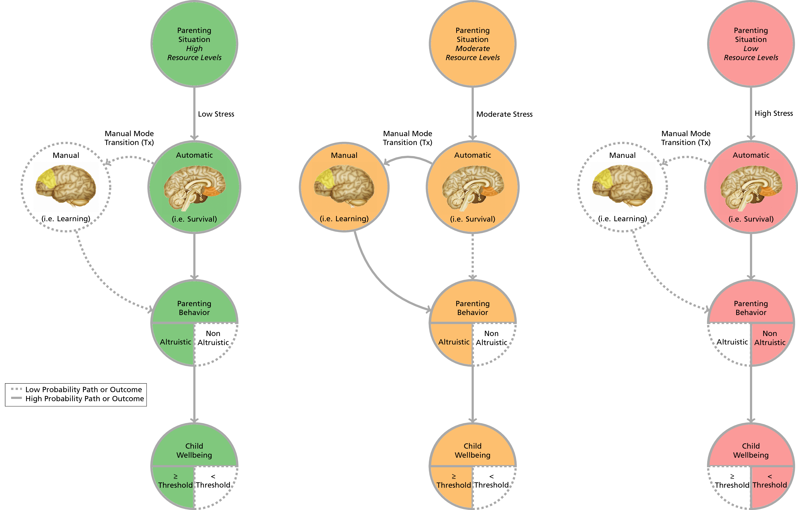
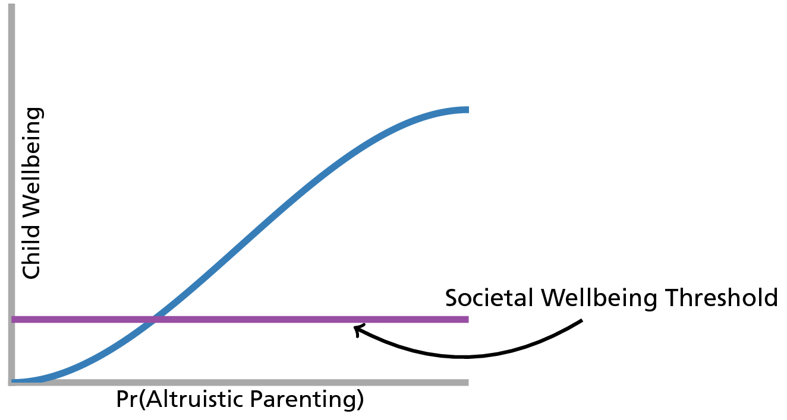
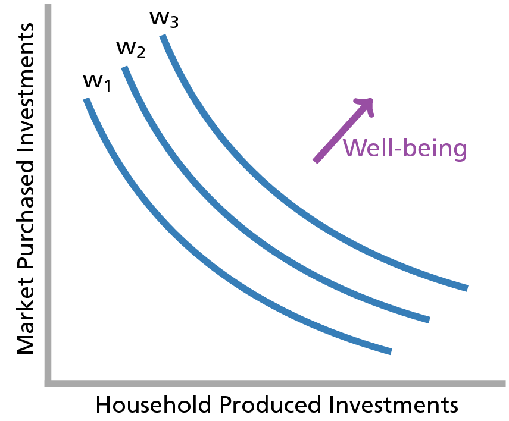
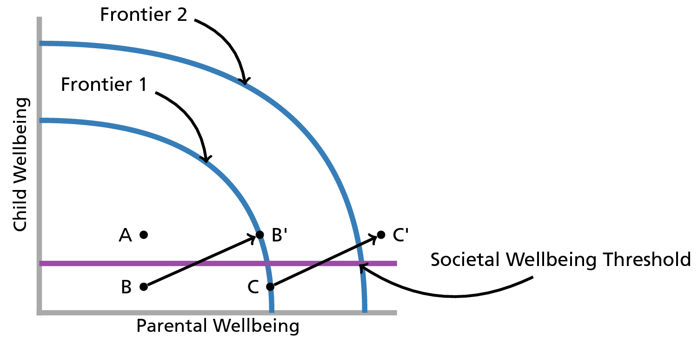

```{r, echo=FALSE, warning=FALSE, message=FALSE, error=FALSE}
require(knitr)
source("tex_convert.R")
require(Hmisc)
require(RColorBrewer)
require(Benchmarking)
require(sqldf)
require(BMA)
#require(Amelia) # generate multiple imputations
require(mitools) # for MIextract()
require(mix) # for mi.inference()
require(ggplot2)
#require(extrafont)
require(pocr)
require(gridExtra)
require(plyr)
require(xtable)
require(knitcitations)
biblio <- read.bib("qualpaper.bib")

cols <- brewer.pal(8,"Set1")
opts_chunk$set(echo = FALSE
               ,warning=FALSE
               ,results='asis'
               ,message=FALSE
               ,error=FALSE
               ,dpi = 400)
```


# Introduction and Background

The purpose of this manuscript is to formally specify and test a general theory of child maltreatment. While other studies have examined correlational links between poverty and child maltreatment and others have even attempted to exploit natural experiments to establish a "causal" effect of poverty, these studies tend to lack a basic framework explaining why we would expect a link between poverty and child maltreatment. This study and the empirical analysis presented here attempt to provide such a basis. 

This paper will begin with a brief treatment of existing child welfare literature on this topic followed by an overview of relevant biological and neuroscientific literature. The concepts developed in this background are then operationally defined on the basis of microeconomic models of household behavior. The model presented and partially tested here brings together theory from evolution, neuroscience, and economics to describe child maltreatment as the non-pathological consequence of parenting under resource constraints. The conclusion presented in this manuscript is that child maltreatment is inextricably linked to household resource levels. While child maltreatment may be undesirable, in most cases it is not pathological. Recognition of this basic distinction has important implications for child welfare policy and practice. 

## Child Welfare Literature

The basic relationship between wealth and child maltreatment is well-established in child welfare literature with previous studies establishing links between resource constraints and substantiated allegations of child maltreatment as well as general involvement with the child welfare system [@Gil1970; @Pelton1981; @Pelton1994; @Russell1984; @Sedlak1996; @Stith2009; @BergerAndWoldfogel2004]. Studies examining administrative data sets of low-income populations (e.g. TANF recipients) have also shown that exogenous resource-decreasing shocks such as welfare-reform [@Courtney2005] or welfare sanctions [@Slack2007] will tend to increase a family's probability of child welfare system involvement. Other studies have exploited experimental income support programs to address income endogeneity problems inherent in other studies and still find an inverse relationship between family income and the probability of child maltreatment [@Cancian2013; @Fein2003]. While there is a paucity of research examining connections between income and child maltreatment outside of the US [@Cameron2006], the evidence from the US seems to suggest a strong and reliable relationship between child welfare system involvement and resource constraints. 

Although the literature provides multiple examples of research establishing a link between resources constraints and child maltreatment, the field is lacking in attempts to formally specify a mechanism to explain this relationship. Two exceptions to this rule include [@Brandon1999] and [@Brandon2001]. In each of these studies, microeconomic models are proposed which outline the manner in which parental resource constraints can lead to maltreatment. The former study suggests that maltreatment is mainly effected by a parent's level of altruism, the latter suggests that maltreatment is a function of how efficiently a parent uses her available resources. Both effects are hypothesized as subject to income constraints. In this manuscript, a variation on the models proposed by [@Brandon1999] and [@Brandon2001] is proposed followed by an attempt to test some key predictions of the model^[Students of social welfare may initially be taken back by the use of economic models to understand the phenomenon of child maltreatment. Historically, social welfare scholars and other non-economic social scientists have tended to approach theory development as a means of organizing broad constructs or ideas to explain experimental or survey data sources. Economists, on the the other hand, have tended to view theory development as a process analogous to theory development in the physical sciences. As such, in much the same way that an astrophysicist seeks to explain the motion of the planets through mathematical equations, economists have tended to rely on a large body of established mathematical theory in order to explain interactions between humans. While the current manuscript will not rely heavily on formal mathematical theory, effort is made throughout this manuscript to demonstrate how the conclusions and major concepts of economic theory are still relevant and applicable to the current problem.]. Before describing the economic components of the model, the manuscript will begin with a brief overview of theory from human evolution and neuroscience which serves as first principles for the model proposed in this manuscript.  

## Human Evolution - Why do Humans Engage in Parenting Activities?

While a full review of the nature vs. nurture debate is beyond the scope of this manuscript, this analysis proceeds from an assumption that human beings are simultaneously biological *and* social beings [see for example @Plomin1994; @Ridley2003]. In other words, human beings are not born as a *tabula rasa*. Humans come pre-wired to engaged in certain activities such as learning languages, consuming nutrients, and engaging in bipedal locomotion. These activities are certainly moderated by the environment in which a human finds himself, but there is no doubt that the human genetic makeup helps people to engage in these activities regardless of environmental circumstances. Basic evolutionary theory demonstrates that such behaviors exist *because* they helped genes to evolve to their present state. 

One type of behavior that enabled human genes to survive is parenting behavior and parental altruism in particular. As described in such seminal works as @Hamilton1964 and @Trivers1974, parental altruism can be defined as those behaviors requiring the investment of time or other resources in a child in a way that benefits the child (in terms of her fitness as a future mate) but comes at a cost to the parent (in terms of her fitness as a future mate). This does not preclude the parent from receiving some sort of benefit from the altruistic act. @Stuebe2010, for example, find that breastfeeding decreases a mother's long term risk of developing certain chronic diseases. To the extent that an increased survival probability would allow a mother to produce more offspring, she can be viewed as benefiting from the activity to some extent. However, when considering the costs associated with breastfeeding (in terms of caloric loss, the opportunity cost of not bearing other children, etc.), there may be a net cost to the mother's long term fitness. In such situations, parental behavior is said to be altruistic. 

The evolutionary explanation for such behaviors is that by engaging in such altruistic acts to her own children, a parent is increasing the survival probability of her own children and thus increasing the survival probability of her own genes (i.e. those genes that she has passed on to her child). Of course, the parent does not consciously strategize in these behaviors to increase the probability that her genes will survive. Throughout evolution, however, the genes that have survived predispose her to act altruistically. These genes survived *because* they were effective at promoting the survival of her genes. 

Biology does not, however, predispose parents to act altruistically indefinitely. Under periods of extreme scarcity, animals (and humans) will reliably engage in triaging activities in which they will fail to invest in children if it appears likely that investments in that child will come at the expense of another child more likely to survive the scarcity (including future children). This point is well articulated in @Chagnon1983 where Chagnon's fieldwork revealed a Yanomamö female who killed her newborn child for the sake of her older child who was still nursing. Indeed, @Daly1988 surveyed a database of 60 anthropological ethnographies finding that a majority of the societies engaged in infanticide. Where reasons for the infanticide were provided, almost 90 percent of the reasons were consistent with triaging activities. 

Until relatively recently in human history, such activities could also be seen in Western societies. @Milner1998 cites an 1860 British newspaper article noting that it had become commonplace for London police to routinely find abandoned infants in the park or other public places. He goes on to cite another British article referring to the large-scale infanticide noting that Middlesex had become a "carnival of slaughter". While infanticide is an extreme example, human behavior tends to exist along spectra and it is reasonable to assume that many parental investment decisions exist along a continuum from optimal to infanticide^[Some have argued that descriptions such as those made by Chagnon are overly simplistic and that parents who had apparently abandoned their children actually made efforts to remain involved in the lives of their children. [e.g. @Murdoch2006]. However, evidence of parents attempts to remain connected and involved in spite of resource constraints does not contradict the argument made here. All that is being stated in this model is that such efforts will always be more difficult for parents operating under resource constraints.]. At some point along the spectrum of parental investment decisions leading to infanticide, societies establish thresholds past which parental investment decisions are considered to be maltreative^[Here, the word "maltreative" is used, as an adjective describing care which is characterized by violence or neglect without regard to malice. Such an adjective is important for the framework presented in this manuscript in order to avoid categorization of behaviors by way of adjectives such as "abusive" or "neglectful" while also avoiding the inherent presence of malice in the use of an adjective such as "malicious". While other candidate adjectives exist (e.g. *laesive* from the Latin adjective *laesus* meaning injured), "maltreative" is chosen due to the relative semantic comfort that most of this manuscript's probable readership will find with this word.]. As described in more detail below, thresholds will exhibit some heterogeneity across societies. This manuscript, however, proceeds from the assumption that in any society a threshold does exist at some point along this continuum. Beyond this point, parental investment decisions can be considered to be maltreative. 

This manuscript is not the first to draw a connection between basic evolutionary principles, resource constraints, and child maltreatment. Echoing some early child maltreatment papers such as @Burgess1978, @Belsky1991 made arguments similar to those made above in which maltreatment was identified as an effective reproductive strategy for humans exposed to resource constrained environmental contexts. These papers received some attention in the field of psychology [@Baumrind1993; @Baumrind1995] in which an evolution-informed theory of child maltreatment was dismissed as overly reductive and failing to account for human agency. The current manuscript seeks to demonstrate how a theory of child maltreatment can be informed by evolutionary theory and still account for human agency without becoming overly reductive. 

## Parental Decision-Making - Why do Parents Make Different Decisions in Different Circumstances?

Understanding human behavior, of course, requires a recognition of human agency - the conscious ability of humans to make decisions about how they interact with their world^[To be clear, the author is explicitly agnostic about *how* humans make such decisions. The assumption is simply that they *do* make such decisions.]. While the field of neuroscience is still new and has only begun to develop a model of parental decision-making [see for example @Ho2014], general neuroscientific models of human decision-making provide some insight into how parents may avoid the maltreative threshold described above. Specifically, a growing body of evidence from brain-imaging studies in neuroscience suggests that humans make decisions with both automaticity (yielding the types of decisions that have allowed human genes to survive for millions of years) and as the result of more thoughtful deliberation (yielding the types of decisions that would cause a mother to avoid killing her children as the result of post-partum depression). 

@Greene2014 outlines a model of this dual-process human brain in which humans are said to possess an automatic mode (primarily driven by structures such as the ventromedial prefrontal cortex) and a manual mode (primarily driven by structures such as the dorsolateral prefrontal cortex). The experimental evidence for this model is well-covered by Greene and will not repeated here. However, Greene demonstrates how a series of experimental studies show that the dual-process theory of the brain implies a dual-process theory of *morality*. The basis of Greene's theory is what he refers to as the Central Tension Principle in which "characteristically deontological judgments are preferentially supported by automatic emotional responses, while characteristically consequentialist judgments are preferentially supported by conscious reasoning and allied processes of cognitive control[(i.e. manual mode)]". In simple terms, moral decisions that require cost-benefit analysis and "thinking" (i.e. the types of decisions that would tend to lead to altruistic parental investment decisions in spite of resource constraints) require humans to engage in manual mode, deliberative thinking. Moral decisions that do not require cost-benefit analysis are viewed to be made automatically - without the need for higher level thought processes. 

In terms of parenting, this manuscript assumes that automatic mode tends to serve humans well most of the time. Human's have evolved to, under normal circumstances, care for their children as described above. This means that most of the time, default parental impulses will tend to avoid a Middlesex-style "carnival of slaughter". Placing a parent under resource constraints requires that the parent switch to manual-mode thinking in order to continue to make altruistic investments in their child in spite of the sorts of automatic impulses they might feel. However, recent experimental evidence gives reason to believe that switching to manual-mode thinking becomes difficult under resource constraints. Specifically, cognitive load (i.e. time pressure or a form of resource constraint) has been observed to decrease manual mode thinking in experimental subjects [@Suter2011; @Paxton2012]. Other recent research by @Mani2013 suggests that the types of cognitive load that are induced in experimental settings are also induced by reductions in income. Taken as a whole, these recent findings lead to the conclusion that relatively poor parents who are faced with choices of how to invest in their children will tend to rely more on automatic mode decision-making processes relative to wealthier parents. Under extremely low levels of resources, parents making decisions in such a manner can reasonably be expected to have a higher probability of engaging in maltreative behaviors. 

For the purposes of this manuscript, specific locations of the brain are not important and the reader may conceptualize the distinction between automatic and manual mode thinking presented above as analogous to the distinction made between the "survival brain" and "learning brain" in @Ford2009. As described in more detail by Ford, the survival brain comprises more primitive portions of the brain and is concerned with processes related to homeostasis and stress response. The learning brain is focused more on problem solving and emotional awareness. When placed under stress (e.g. cognitive load or other resource constraints), humans will tend to rely more on the survival brain than the learning brain. To reiterate the conclusion of the previous paragraph, under extremely high levels of stress (or for the purposes of this paper, extremely low resource levels), parents can reasonably be expected to have a higher probability of engaging in maltreative behaviors.  

## State Decision-Making - Why do State's Intervene in Family Lives?

Since the 19th century, Western society and most of the world has evolved into a series of social welfare states which also seek to prevent the existence of "carnival[s] of slaughter". With respect to the family, governments have come to acknowledge an implicit agreement between parents and children which consists of a fiduciary relationship between parents and children in which children are viewed as principals and parents are viewed as "...agent[s] of the child's wellbeing" [p. 57, @TestaAndPoertner2010]. Under this definition, if a parent acts in her own self-interest at the expense of her children's wellbeing, a principal-agent problem can be said to exist. Moreover, because this principal-agent problem tends to lead to children who are less well-developed and less capable of full participation in society as adults [e.g. @BarroEtAl1986], the problem also produces a negative externality. In other words, society is made to pay for individual parental decisions. 

For the purposes of this manuscript, instances in which this contract is broken down are viewed to be instances of child maltreatment. When children are maltreated, the state is viewed to have a fiduciary obligation to both the child and to the rest of society. The state's obligation to the child is to ensure that actions are being taken to promote the child's wellbeing at or above some community standard. If the parent is unable to fulfill this role, the state is required to act *in loco parentis* or *in place of the parent* to ensure that proper investments are made in the child's human capital. In ensuring that these investments are made, the state also works to maximize social welfare for society as a whole by ensuring that externalities caused by a parent's failure to properly invest in his children are minimized. 

## The Distinction Between Maltreatment and Child Welfare System Involvement

While some readers may be concerned that the discussion to this point has conflated maltreated children with children that are involved with the child welfare system a brief review of descriptive data concerning the child welfare system suggests that the vast majority of children involved with Western child welfare systems have parents who have engaged in behaviors consistent with the theory reviewed above. Specifically, the theory reviewed in previous sections suggests that the vast majority of human parenting activity is focused on caring for children as opposed to harming them. If this were the case, it would be expected that most of the parents who are involved with the child welfare system have been trying to effectively parent their children and have failed to do so. A review of evidence concerning serious injuries in Western child welfare systems suggests that this may be the case. For example, the results from the most recent National Incidence Study demonstrate that the majority of maltreatment in the US does not result in serious injury^[While the studies cited here vary in what they consider to be "serious" maltreatment, the definitions are similar and generally indicate an instance of maltreatment in which medical attention was required.] [@Sedlak2010]. This finding is consistent across prior NIS studies and earlier surveys of child maltreatment in the US [e.g. @Gil1970]. Within the Canadian child welfare system, @TrocmeEtAl2007 finds that just 3% of the substantiated maltreatment reports were severe enough to warrant any medical intervention^[There are, of course, differences between the Canadian and US child protection systems. However, there are inherent cultural similarities between the two countries as well as a common lineage in Elizabethan Poor Law and progressive era children's societies. Furthermore, the overall incidence of child maltreatment in Canada is similar to that of the US. For instance, the 2008 incidence of child maltreatment in the US was 10.3 per 1,000 children in the population @HHS2013 compared with a rate of 14.19 in Canada @TrocmeEtAl2010. While a difference of 4.6 incidents of maltreatment per 1,000 children is not inconsequential, we can reasonably expect the proportion of serious incidents of child maltreatment in the US to be similar to that of Canada.]. Setting aside problems with reporting and erroneous substantiation practices, one of two possibilities exist for less severe cases: 1) that parents in these cases intend to harm their children and fail to do so (and are thus reported to the child protection authorities), or 2) that parents in these cases try to effectively parent their children and fail to do so (and are thus reported to child protection authorities for some other reason (e.g. inappropriate discipline, failure to provide proper clothing, etc.)). The theory reviewed above is suggestive of the latter. 

## Proposed Theoretical Model

Based on the theory reviewed above, this manuscript will proceed from the following assumptions: 

1. That under high resource levels, parental behavior has evolved to create automatic impulses (i.e. "survival brain" processes) which tend to yield altruistic parenting behaviors and that such behaviors will tend to maximize a child's wellbeing within available resources, 
2. That when operating under moderate resource levels, parents will tend to experience tendencies to parent non-altruistically but can transition to higher-level, manual-mode forms of cognition. This form of cognition allows parents to still engage in altruistic parenting behaviors which will tend to maximize a child's wellbeing despite the moderate resource levels, 
3. That when operating under low resource levels, parents will tend to experience tendencies to parent non-altruistically and will also have difficulty transitioning to higher-level, manual-mode forms of cognition. An inability to transition to higher-level, manual-mode forms of cognition under relatively low resource levels will tend to yield non-altruistic parenting behaviors which do not maximize a child's wellbeing, and
4. That when a child's cumulative wellbeing (actual or probabilistic) falls below the wellbeing threshold for a given society, the society will tend to act *in loco parentis*. 

These basic assumptions are displayed graphically in Figures 1 and 2 below. Figure 1 shows probable paths of parental behaviors and child wellbeing under different levels of resources. Figure 2 graphically displays how child wellbeing might progress as a function of altruistic parenting behavior and how this behavior can lead to wellbeing at or above societal thresholds. 

```{r, eval=FALSE}
tex_convert(code = "general_conceptual_model_flow.Rnw")
```
\includepdf[scale=0.95,pages={1},landscape=true]{general_conceptual_model_flow.pdf}



```{r, eval=FALSE}
tex_convert(code = "general_conceptual_model_graph.Rnw")
```

\includepdf[scale=0.7505,pages={1}]{general_conceptual_model_graph.pdf}


While the logic of the current manuscript assumes the existence of an underlying theoretical structure similar to that in Figures 1 and 2, only two components of the above theoretical model will be specifically tested: parenting situation (i.e. resource level) and parenting behavior. Specifically, this manuscript seeks to test the relationship between parenting situation and parenting behaviors. The prediction of the model above is that, as resource levels increase, altruistic parenting behavior will also increase.  

# Operational Definition of Key Constructs

## Microeconomic Background

In order to test the relationship between parenting situation and parental altruism, it is first necessary to develop an operational definition of altruism for the purposes of this manuscript. This will be accomplished by relying on basic household microeconomic theory. For present purposes, an assumption is made that a particular household contains two individuals: a parent and a child^[This is a simplifying assumption made for the purposes of this manuscript. The model proposed here, however, readily extends to multiple children and multiple parents as well as to children of varying ages and genders.]. A further assumption is made that the child and parent experience increases in wellbeing as a function of their consumption of household resources such as money, parenting time, etc. These resources could be shared or consumed completely by either a parent or child (see [@Gorman1976] for a description of how private and public goods could be distributed throughout a household).

In using the term wellbeing, this manuscript draws an implicit equivalence between the term and the traditional concept of utility utilized in standard microeconomic theory. In this way, this manuscript follows the line of literature started by @Easterlin1974 which acknowledges that the choices that people make are subject to the context in which an individual finds themselves and that an individual's wellbeing is derived from more than just increased consumption. This view implies that income-based measures of wellbeing should be thought of as necessary but not sufficient to the study of wellbeing [@Graham2008]. In general, this manuscript proceeds from an assumption that wellbeing can be conceptualized by what philosophers and positive psychologists would refer to as eudaimonia - a higher level of happiness [@Kashdan2008] which can be viewed as inclusive of cognitive or hedonic forms of happiness. While this manuscript does not explicitly test a eudaimonic formulation of wellbeing in economic models, the reader should be clear that the models and theoretical assumptions presented here are, in the general case, consistent with notions of wellbeing and happiness that are more familiar to non-economists and social welfare scholars [e.g. @Ryff1989] and that these conceptions of wellbeing do not necessarily reduce to hedonism or require strictly "rational" preferences.  

Like the economic conception of utility, wellbeing can be understood as the level of satisfaction that an individual experiences as the result of consumption and other choices about how to live their lives^[It is important to note that human wellbeing is not just a function of the items that an individual might purchase or consume; it is more generally a function of an individual's preferences and the choices that individuals make throughout their lives. Talking in terms of consumption is simply a convenient way of discussing human choices and the constraints (e.g. budgets, etc.) that people have on there choices.]. For present purposes, two composite goods that could be consumed by a child are considered: household-produced investments (e.g. making meals, reading to the child, playing with the child, etc.) and market purchased investments for the child (e.g. childcare, etc.). The logic of this manuscript implicitly follows @Brandon2001 and assumes that a child's *total* wellbeing is comprised of household-produced investments and market purchased investments. This does not imply that wellbeing is simply a function of financial resources. This assumption simply implies that a child's *total* wellbeing is a function of all of the household resources (e.g. time, energy, money, etc.) that are directed to a child. 


```{r, fig.width=1.1, fig.height=1.1, eval=FALSE}
x <- c(.5, 1.5, 4.5)
y <- c(4.5, 1.5, .5)
wb1 <- data.frame(bezier(x, y, evaluation = 500))
wb2 <- data.frame(bezier(x+.5, y+.5, evaluation = 500))
wb3 <- data.frame(bezier(x+1, y+1, evaluation = 500))

write.table(wb1, 'wb1.dat',sep='\t', quote=F, col.names=F, row.names=F)
write.table(wb2, 'wb2.dat',sep='\t', quote=F, col.names=F, row.names=F)
write.table(wb3, 'wb3.dat',sep='\t', quote=F, col.names=F, row.names=F)
tex_convert(code = "basic_utility.Rnw")
```

\includepdf[scale=0.4275,pages={1}]{basic_utility.pdf}


## Altruism

An important point from the discussion above is that parents can invest in their child's wellbeing *or* their own wellbeing. As noted above, parental altruism can be defined as those behaviors requiring the investment of time or other resources in a child in a way that benefits the child but comes at a cost to the parent. Evolutionary theory defines this benefit on the basis of the parent or child's fitness as a future mate. Here, the notion of altruism is expanded to define this benefit in terms of parent or child wellbeing. In other words, parental altruism is defined as those parental behaviors or decisions requiring the investment of time or other resources in a child in a way that increases the wellbeing of the child but at a cost to parental wellbeing. This expanded definition requires the implicit assumption that increases in wellbeing will also tend to increase an individual's fitness as a future mate. As described in more detail in the technical appendix, this manuscript also proceeds from the assumption that parental altruism can be operationally defined as the proportion of household resources  (including emotional resource, time, etc.) expended on a child. For the purposes of this paper, resources expended on a child are assumed to be completely consumed by the child. That is, the parent is not assumed to benefit directly from the resource expenditure directed toward the child. This is a simplifying assumption made to accommodate the data utilized in this study. The theory presented here is, however, general enough to accommodate resource expenditures which benefited the parent and the child in future analyses.  

## Maltreative Behaviors

For the purposes of this manuscript, maltreative behaviors can be defined as those behaviors that will ultimately bring a child's cumulative well-being below the societally defined threshold discussed above. The current manuscript will focus specifically on parental discipline strategies. Following the field of behavioral psychology, this manuscript distinguishes parental discipline strategies into those strategies involving the provision of a stimulus (e.g. spanking, yelling, etc.) and those involving the removal of a stimulus (e.g. time-out, removing a toy, etc.). The behaviorist literature classifies these strategies as Type I and Type II discipline respectively. Generally speaking, Type I strategies are less-likely to promote child well-being than Type II discipline strategies. For example, Type I strategies tend to be problematic for parent-child relationships and can sometimes lead to behavioral problems for children including delinquency and aggression [@Gershoff2002; @Taylor2010] - phenomena which are assumed to be negatively associated with a child's cumulative wellbeing.

## Connecting Altruism to Maltreative Parental Behaviors

Following @Brandon2001 and @Brandon1999 and the discussion above, an assumption is made here that a given society sets a minimum wellbeing threshold. When parents invest in their children above this level, society is generally accepting of the parent. When parents invest below this level, the state must intervene to ensure a minimum level of wellbeing for the child. Figure 4 illustrates this point in terms of a wellbeing production possibility possibility. Each curve (Possibility 1 and Possibility 2) represent the possible outcomes of parental and child wellbeing that could be produced within a lower (Possibility 1) and higher (Possibility 2) level of resources. While Figure 3 is representative of a particular decision that a household may make between two forms of investment for a child, Figure 4 represents the outcomes of one or many such decisions, over time in terms of the wellbeing of both the parent and the child. 

```{r, fig.width=1.925, fig.height=1.925, eval=TRUE}
y <- c(0, 3.9, 3.9)
x <- c(3.9, 3.9, 0)
ppf1 <- data.frame(bezier(x, y, evaluation = 500))
ppf2 <- ppf1*1.4
write.table(ppf1, 'ppf1.dat',sep='\t', quote=F, col.names=F, row.names=F)
write.table(ppf2, 'ppf2.dat',sep='\t', quote=F, col.names=F, row.names=F)
tex_convert(code = "wellbeing_production_possibilities.Rnw")
```

\includepdf[scale=0.7505,pages={1}]{wellbeing_production_possibilities.pdf}


Several points are immediately clear from this diagram. To begin, it can be seen that households operating below a given curve may not be using all available household resources. Such behavior, however, does not necessarily constitute maltreatment. This is the case of point $A$ which represents a hypothetical household which is not maximizing the potential wellbeing for the parent or for the child. However, the household is still producing above the minimal societal expectations. An example of such a household may be a mother who recreationally uses alcohol and marijuana in such a way that she fails to raise the wellbeing of her self or her child to the maximum level allowable under a given level of resources but is still able to make parenting decisions which keep her child above society's minimal expectations. Sometimes, however, failing to use all available resources does cause a household to fall below societal expectations for child wellbeing. An example might be a more extreme form of illegal drug use such as the regular consumption of illicit methamphetamine hydrochloride (i.e. "crystal meth") to the point where a child's basic needs are not being met. Point $B$ could represent such a situation. By moving to point $C$, $B$ could be brought above societal expectations within the existing resources of the household. In other words, they could stop maltreating their child without any financial assistance. Such movement might take place, for example, as the result of a drug treatment program in which a substance-abusing parent achieves sobriety and is able to spend more time with their child. Point $D$ represents a point where the parent is using all of her available resources by investing along Possibility 1 but is still investing below societal expectations. In such an instance, the state could provide a wealth transfer to the parent and, holding parental altruism constant, increase the investment in the child above societal expectations (to point $E$). The state could also seek to move the parent from $D$ to $C$ by trying to change household and/or parental preferences. An example of this might be the application of a parenting intervention to teach the parent new discipline strategies. 

Most importantly for the current manuscript, is the notion that a given household will invest more or less in a child depending on a parent's level of altruism (this will also depend on a household sharing rule as discussed in the technical appendix). This point is well articulated by consideration of points $C$ and $D$ in Figure 4. These individuals represent different combinations of parental and child wellbeing in households with exact same level of resources. According to the assumptions outlined above, the difference between these two points takes place as the result of differences in altruism between the parents represented by $C$ and $D$ - Parent $C$ has a greater level of altruism than $D$. As drawn in this figure, $D$ has such a low level of altruism that they invest in their child below the societal threshold^[In addition to altruism, @Brandon2001 developed the concept of parental efficiency in various childcaring strategies. The concept of parental efficiency was tested in analysis related to this manuscript and is described in the technical appendix to this manuscript. Efficiency, as defined in these analyses, proved to have no significant predictive power with respect to parental discipline strategies. While parental efficiency may have bearing on future analyses, substantive discussions of efficiency are excluded from this manuscript for the sake of brevity.]. A single investment below the threshold may or may not constitute child maltreatment. However, every investment is assumed to contribute either positively or negatively to a child's cumulative wellbeing. 

As described in the previous section, the parental investment of interest for the current manuscript is parental discipline strategy. This manuscript proceeds from the assumption that, while Type II discipline strategies are more likely to maximize a child's wellbeing, they are also more resource intensive than Type I discipline strategies and more likely to require manual mode thinking (i.e. higher-level thinking). For example, spanking a child can be reasonably thought of as a discipline strategy which stems from automatic mode thinking and requires a relatively low level of cognitive resources. A "time-out", however, can be reasonably thought of as a strategy requiring at least some manual mode thinking and, as compared to spanking, a high level of cognitive resources (e.g. monitoring the child in their state of time out, etc.). In other words, Type II discipline strategies can be reasonably thought of as more altruistic than Type I parenting strategies. As stated, the main hypothesis of this manuscript is that, as resource levels increase, altruistic parenting behavior will also increase. While prior research has reliably identified a link between Type I strategies and low levels of resources [@Berger2007; @Berger2008; @Berger2009; @Paxson2002], in the current analysis, an independent effect of altruism while controlling for the effects of resources is expected. 

# Methods
## Data and Analytical Strategy

The National Survey of Early Childhood Health (NSECH) serves as the main data for this analysis. This survey involved telephone interviews with over 2,000 parents with children under 3 years of age in early 2000 (n=2,068). In addition to various demographic factors, the NSECH also collected information on the income of parents and their employment status, the time that children spend in the care of other individuals, the source of the care (childcare provider, etc.), the time that parents spend caring for their children in various activities (story-reading, etc.), and parental discipline strategies, (spanking, time-out, etc.). 

A main barrier with the NSECH data is that the survey provides information on income, childcare, time-investments, and discipline strategies in ordinal scales which limits the possibility of basic mathematical operations requisite for the analysis conducted here (e.g. summing). The ordinal nature of the NSECH data is addressed by making use of other nationally representative data sets. Specifically, Bureau of Labor Statistics (BLS) data from the 2003 American Time Use Survey (ATUS) and the 2004 Consumer Expenditure Survey (CE) is utilized. Using this data to develop "prior" distributions for each measure, the following smoothing algorithm is implemented which provides a method to treat the data from these surveys as continuous:

1. Match the relevant variables from the NSECH and the relevant BLS survey,
2. Visually examine the distribution of the BLS data,
3. Calculate the MLE of a reasonable prior for the relevant variable,
4. Simulate a sampling distribution of relevant variable with a Monte Carlo function, and
5. Sample from the simulated data sets within intervals as identified in the ordinal NSECH data.  

Two exceptions are made to this algorithm. The first exception is in the estimate of the total household expenditures on child care. For this measurement, CE-based estimates of the average expenditures for childcare in various childcare settings were obtained and multiplied by the total hours that NSECH respondents reported that their child spent in the corresponding settings. The variance in the hours reported in NSECH provides a continuous measurement of this expenditure without the need to incorporate the variance of a CE-based "prior". Also, in estimating a continuous measurement of income, a distribution as reported in a working paper by @Bandourian2002 is utilized which provides a reasonable prior distribution for US income. 

Further details of the data preparation strategy (and subsequent steps in the analysis) are available in a [GitHub repository](https://github.com/mienkoja/qualpaper) and will also be included in the technical appendix to this manuscript. 

## Descriptions of Key Variables

### Household Income

Income in the public-use NSECH data is reported in terms of total household income on an 8-point Likert scale starting at $\le$ 7,500 and proceeding in increments of 10,000 to $\ge$ 75,000. Continuous income is calculated using the algorithm specified above. As income is reported as "total household income", depending on the use, the estimated continuous value is divided by the number of adults in the household in order to arrive at an estimate of individual wages for parents who report some employment.    


### Altruism (i.e. Household Resources Devoted to Child Well-Being)

Given the assumptions described above and in the technical appendix, the total household resources devoted to the child can be thought of as a measurement of "household altruism" toward the child. In order to calculate altruism, the following steps are followed: 

1. Taking the estimate of household income calculated above, the count of adults in the home, and the estimated number of work hours, parent's wage is estimated as $(\text{income}/\text{count of adults})$ divided by $(365.25\cdot(\text{work hours}))$. For non-working mothers, time is valued based on the estimated market rate for childcare calculated from the CE.

2. Altruism is then calculated by summing child care expenditures $(\text{home based child care} + \text{market child care})$ and then dividing that value by the value of hours in a year $(\text{parental wage from step 1})\cdot(365.25)\cdot(24)$.

### Probability of All Type II Discipline

In order to obtain a single indicator of a parent's propensity to engage in Type II discipline strategies, survey information concerning the discipline strategies of the parent is used. Specifically, for each person, the probability that *all* of their reported discipline strategies would be Type II is calculated. 

Parents in the NSECH were asked 5 questions regarding their discipline strategies. The specific question pattern is as follows:

> The next questions are about discipline. Parents vary a lot in how they discipline and children also vary in their response to being disciplined. I am going to read a list of methods of discipline parents might use with children (CHILD)'s age. For each, please tell me if you use that method often, sometimes, rarely, or never with (CHILD). First, how about raising your voice or yelling? How about spanking? How about taking away a toy or treat? How about giving a time-out, that is making (CHILD) take a break from whatever activity {he/she} is involved in? How about explaining to (CHILD) why {his/her} behavior is not appropriate.

Using this information, the probability of all type II discipline is calculated as follows: 

1. In order from first to last, the first and second are classified as Type I strategies as they are are providing a stimulus to the child. The third and fourth questions are classified as Type II strategies as they remove a stimulus from the child^[This paper categorizes behaviors into Type I and Type II strategies. From a strictly behavioral perspective, "explaining" strategies would be considered to be a form of positive discipline (i.e. a Type I) strategy similar to yelling and spanking; the parent is giving instead of taking. Nonetheless, a salient argument could be made that forcing a child to engaging in verbal communication removes them from a stimulus and is thus a Type II strategy. Given the potential for confusion, the last question is removed from the analysis and focus is instead made on the four remaining behaviors which clearly fall within the Type I and Type II strategies. In cross-validation analyses, the results for models in which "explaining" is entered into the model as a Type I strategy, a Type II strategy, or excluded are nearly identical.]. 
2. Each question response is then dichotomized. Questions in which a subject answered "Never" were coded as 0 and 1 otherwise. 
3. The probability of all Type II discipline is calculated for each subject as the sum of dichotomized Type II responses, divided by the sum of dichotomized Type II responses plus the sum of dichotomized Type I responses $(\sum\text{Type II}/(\sum\text{Type II} + \sum\text{Type I}))$.
  
### Additional Variables

In addition to the key variables of interest, additional variables utilized in previous NSECH research concerning discipline strategies are included in the analysis. Specifically, @Regalado2004 makes use of child age, maternal race, maternal age, maternal marital status, maternal education, maternal frustration levels, child health, and developmental concerns as potential risk factors in their multivariate analysis. The current analysis also makes use of the count of children in the household as an additional variable. A descriptive summary of all the identified variables is provided in the table below. 

```{r LoadData, echo=FALSE, message=FALSE}
#clear memory
#rm(list=ls(all=TRUE)) 

setwd("C:/Users/mienkoja/Dropbox/qualpaper")
#setwd("~/Dropbox/qualpaper/")

set.seed(123456)
#load("~/Dropbox/qualpaper/sech_out.RData")
load("C:/Users/mienkoja/Dropbox/repos/qualpaper/sech_out.RData")
```

```{r Benchmarking, echo=FALSE, results='hide', message=FALSE}
# see page 215 from Bogetoft and Otto 2011
sfa_dat <- as.data.frame(na.omit(with(r_dat, cbind(id
                                                   ,w_ta=w_ta*alpha
                                                   ,t_ta=t_ta*alpha
                                                   ,t_tvc
                                                   ,x_c)
                                      )
                                 )
                         )

sfa_dat <- subset(sfa_dat, (is.infinite(sfa_dat$w_ta)==FALSE | is.infinite(sfa_dat$t_ta==FALSE)
                             )
                  )
sfa_dat <- subset(sfa_dat, !(sfa_dat$w_ta==0 & sfa_dat$t_ta==0))

x <- with(sfa_dat, cbind(w_ta, t_ta)) 
y1 <- matrix(sfa_dat$t_tvc)
y2 <- matrix(sfa_dat$x_c)

t_tvc_sfa <- sfa(log1p(x), log1p(y1))

summary(t_tvc_sfa)

#percentage of inefficiency variation to total variation
lambda <- lambda.sfa(t_tvc_sfa)
100*lambda^2/(1+lambda^2)

#variance for inefficiency
sigma2u.sfa(t_tvc_sfa)

#variance for random errors
sigma2v.sfa(t_tvc_sfa)

#residuals
e <- residuals(t_tvc_sfa)

#sigma 2
s2 <- sigma2.sfa(t_tvc_sfa)

mustar <- -e*lambda^2/(1+lambda^2)
sstar <- lambda/(1+lambda^2)*sqrt(s2)
tej <- exp(-mustar-sstar*(dnorm(mustar/sstar)/pnorm(mustar/sstar)))
tejt <- data.frame(id=sfa_dat$id, tejt=tej[1:1822])
#tejt <- data.frame(id=sfa_dat$id, tejt=tej[1:927])

r_dat <- sqldf("select 
                  r.*
                  ,tejt
                from r_dat r
                left join tejt tt
                  on r.id=tt.id")

#try benchmarking for x_c
x_c_sfa <- sfa(log1p(x), log1p(y2))

summary(x_c_sfa)

#percentage of inefficiency variation to total variation
lambda <- lambda.sfa(x_c_sfa)
100*lambda^2/(1+lambda^2)

#variance for inefficiency
sigma2u.sfa(x_c_sfa)

#variance for random errors
sigma2v.sfa(x_c_sfa)

#residuals
e <- residuals(x_c_sfa)

#sigma 2
s2 <- sigma2.sfa(x_c_sfa)

mustar <- -e*lambda^2/(1+lambda^2)
sstar <- lambda/(1+lambda^2)*sqrt(s2)
tej <- exp(-mustar-sstar*(dnorm(mustar/sstar)/pnorm(mustar/sstar)))
#tejx <- data.frame(id=sfa_dat$id, tejx=tej[1:927])
tejx <- data.frame(id=sfa_dat$id, tejx=tej[1:1822])


r_dat <- sqldf("select 
               r.*
               ,tejx
               from r_dat r
               left join tejx tx
               on r.id=tx.id")

X <- with(sfa_dat, cbind(w_ta = w_ta/t_ta, t_tvc, x_c))
Y <- matrix(sfa_dat$t_ta, ncol=1)
dist <- sfa(log1p(X), -log(Y))
tedist <- te.sfa(dist)
sigma2u <- sigma2u.sfa(dist)
sigma2v <- sigma2v.sfa(dist)

te <- data.frame(id=sfa_dat$id, te=tedist)


# commented code is to possibly model te as a hyper parameter
#nsim <- 10
#nobs <- 1823

#te <- data.frame(id=rep(sfa_dat$id, nsim), te=rep(tedist, nsim))
#err <- rep(NA, nsim*nobs)
#err <- rnorm(1, mean=0, sd=sigma2v)-rnorm(1, mean=0, sd=sigma2u), nsim*nobs)
# for (i in 1:(nsim*nobs)){
#     err[i] <- rnorm(1, mean=0, sd=sigma2v)-rnorm(1, mean=0, sd=sigma2u)  
# }
# te$err <- err
# te$te_sim <- te$te + te$err
# 
# idx <- data.frame(j=rep(seq(1:nobs), nsim), i = rep(seq(1:nsim), nobs), tot = seq(1:(nsim*nobs)))
# 
# m <- lm(tot~j+i, dat=idx)

r_dat <- sqldf("select 
               r.*
               ,te
               from r_dat r
               left join te te
               on r.id=te.id")
```

```{r SummaryVars, echo=FALSE}
r_dat_sub <- subset(r_dat
                    ,r_dat$c_age > 18
                    ,select = c(w_ta
                                ,neg_count
                                ,neg_count_alt1
                                ,neg_count_alt2
                                ,pos_count
                                ,pos_count_alt1
                                ,pos_count_alt2
                                ,alpha 
                                ,te 
                                ,c_age
                                ,w_ta
                                ,cnt_ch
                                ,m_white
                                ,m_age
                                ,m_mar
                                ,m_college 
                                ,m_hi_frus 
                                ,c_health
                                ,c_hi_health                    
                                ,dev_cnc)
)
#transform some variables
r_dat_sub$te <- as.numeric(r_dat_sub$te)
r_dat_sub$log_w_ta <- log(r_dat_sub$w_ta)     
r_dat_sub$log_m_age <- log(r_dat_sub$m_age)
r_dat_sub$log_c_age <- log(r_dat_sub$c_age)
#final calculation for p_all_neg
r_dat_sub$p_all_neg <- (r_dat_sub$neg_count/2)/((r_dat_sub$neg_count/2)+(r_dat_sub$pos_count/3))
r_dat_sub$p_all_neg_alt1 <- (r_dat_sub$neg_count/3)/((r_dat_sub$neg_count/3)+(r_dat_sub$pos_count/2))
r_dat_sub$p_all_neg_alt2 <- (r_dat_sub$neg_count/2)/((r_dat_sub$neg_count/2)+(r_dat_sub$pos_count/2))
r_dat_sub$p_all_neg_d <- ((r_dat_sub$neg_count/2)+(r_dat_sub$pos_count/3))
r_dat_sub$p_all_neg_alt1_d <- ((r_dat_sub$neg_count/3)+(r_dat_sub$pos_count/2))
r_dat_sub$p_all_neg_alt2_d <- ((r_dat_sub$neg_count/2)+(r_dat_sub$pos_count/2))

#calculate some interactions
r_dat_sub$alpha_by_log_w_ta <- r_dat_sub$alpha*log(r_dat_sub$w_ta)     
r_dat_sub$te_by_log_w_ta <- r_dat_sub$te*log(r_dat_sub$w_ta)
r_dat_sub$alpha_by_te <- r_dat_sub$te*r_dat_sub$alpha
r_dat_sub$alpha_by_log_w_ta_by_te <- r_dat_sub$te*log(r_dat_sub$w_ta)*r_dat_sub$alpha

x_disp=subset(r_dat_sub, select=c(p_all_neg
                             ,alpha
                             ,te 
                             ,w_ta
                             ,cnt_ch
                             ,c_age
                             ,m_white
                             ,m_age
                             ,m_mar
                             ,m_college 
                             ,m_hi_frus 
                             ,c_hi_health                    
                             ,dev_cnc))
```

```{r descstats, echo=FALSE, results='asis'}
dtf <- t(sapply(na.omit(x_disp), each(min, max, mean, median)))
colnames(dtf) <- c("Min","Max","Mean", "Median")
rownames(dtf) <- c("Probability of All Type II"
                   ,"Altruism"
                   ,"Efficiency^[Ibid.]"
                   ,"Income"
                   ,"Child Count"
                   ,"Child Age (mos)", "White Mother", "Maternal Age", "Married Mother"
                   ,"Maternal College", "Maternal Frustration", "Child Healthy", "Devolpmental Concerns")
#dtf <- xtable(dtf, label='tabdesc',caption='Descriptive Statistics', hline.after=c(0))
#align(dtf) <- "crrrr"
#print(dtf, sanitize.text.function = function(x){x}, scalebox=1, type='html')

kable(round(dtf, 2))
```


## Statistical Analysis
All of the identified covariates were subjected to Bayesian Model Averaging (BMA) across generalized linear models (GLMs) to determine the most probable set of covariates. The details of BMA are beyond the scope of this manuscript. The reader is directed, however, to @Hoeting1999 for a discussion of the overall approach. Briefly, BMA is a process through which a researcher identifies a set of potential $k$ covariates and a candidate statistical model (e.g. a quasibinomial generalized linear model (GLM)). The analyst then estimates the statistical model for every possible combination of models ($2^k$ models). Each model receives a weighting based on the posterior probability of the model beginning with a prior probability which represents the researcher's beliefs prior to conducting the analysis. For the current problem, the analysis utilizes a relatively conservative uniform prior. A quasibinomial GLM is chosen for the BMA to account for overdispersion in the Probability of all Type II Discipline. The BMA is implemented via the R `BMA` package authored by @Raftery2009. 

# Results

The results of the BMA indicate that the "most probable" of the $2^k$ fitted models is a model which only includes Altruism and Income. Specifically, this model has a posterior probability of 0.472 and the next most-probable model has a posterior probability of 0.16. The estimates for the chosen model are displayed in the table below. All parameters are statistically significant at the 0.0001 level. As can be seen, the probability of choosing all Type II strategies positively and significantly associated with altruism and income. The results are displayed graphically in the figures below. 

```{r RunModel, echo=FALSE, message=FALSE, results='asis'}
# m1 <- glm(p_all_neg ~ alpha +
#                  log_w_ta
#                  ,family=quasibinomial
#                  ,weights=r_dat_sub$p_all_neg_d
#                  ,data=r_dat_sub)
# names(m1$coefficients) <- c("Intercept", "Altruism", "Income")
# #colnames(coefficients(summary(m1)))  <- c("$\\Beta{X}$", "SE", "$t$", "$p$")
# #m1_tbl <- xtable(m1,label='tabmod',caption='Model Results', hline.after=c(0))
# #print(m1_tbl, scalebox=1, type='html')
# kable(coefficients(summary(m1))[,1:3])
# 
# m1_alt1 <- glm(p_all_neg_alt1 ~ alpha +
#                  log_w_ta
#                  ,family=quasibinomial
#                  ,weights=r_dat_sub$p_all_neg_alt1_d
#                  ,data=r_dat_sub)
# names(m1_alt1$coefficients) <- c("Intercept", "Altruism", "Income")
# #colnames(coefficients(summary(m1)))  <- c("$\\Beta{X}$", "SE", "$t$", "$p$")
# #m1_tbl <- xtable(m1,label='tabmod',caption='Model Results', hline.after=c(0))
# #print(m1_tbl, scalebox=1, type='html')
# kable(coefficients(summary(m1_alt1))[,1:3])

m1_alt2 <- glm(p_all_neg_alt2 ~ alpha +
                 log_w_ta
                 ,family=quasibinomial
                 ,weights=r_dat_sub$p_all_neg_alt2_d
                 ,data=r_dat_sub)
names(m1_alt2$coefficients) <- c("Intercept", "Altruism", "Income")
#colnames(coefficients(summary(m1)))  <- c("$\\Beta{X}$", "SE", "$t$", "$p$")
#m1_tbl <- xtable(m1,label='tabmod',caption='Model Results', hline.after=c(0))
#print(m1_tbl, scalebox=1, type='html')
kable(coefficients(summary(m1_alt2))[,1:3])
```

```{r ModelResultGph1, message=FALSE, echo=FALSE, fig.cap="$P(\\text{All } D_{II})$ as a function of $\\log{y}$", fig.lp="mod"}
sim_dat <- subset(r_dat_sub, select=c(alpha, log_w_ta))

sim_dat_w1 <- with(sim_dat
                 ,data.frame(alpha = mean(sim_dat$alpha, na.rm=TRUE)
                             ,log_w_ta = rep(seq(from = 4, to = 13, length.out = 1000))
                             )
                 )

sim_dat_w2 <- cbind(sim_dat_w1
                    ,predict(m1_alt2, type="response", newdata=sim_dat_w1, se = TRUE))

sim_dat_w3 <- within(sim_dat_w2, {
    LL <- fit - (1.96 * se.fit)
    UL <- fit + (1.96 * se.fit)
})

sim_dat_a1 <- with(sim_dat
                 ,data.frame(log_w_ta = mean(sim_dat$log_w_ta, na.rm=TRUE)
                             ,alpha = rep(seq(from = 0, to = 1, length.out = 1000))
                             )
                 )

sim_dat_a2 <- cbind(sim_dat_a1
                    ,predict(m1_alt2, type="response", newdata=sim_dat_a1, se = TRUE))

sim_dat_a3 <- within(sim_dat_a2, {
    LL <- fit - (1.96 * se.fit)
    UL <- fit + (1.96 * se.fit)
})

breaks=c(.40, .45, .50, .55, .60)
# 
# 
# 
# w_p <- ggplot(sim_dat_w3, aes(x = log_w_ta, y = fit)) + 
#         geom_ribbon(aes(ymin = LL, ymax = UL),alpha = 0.2, fill=cols[2]) + 
#         geom_line(size = 1, colour=cols[2]) +
#         xlab("Log of Income") +
#         ylab("Probability of All Type II Discipline") +
#         scale_y_continuous(labels = percent
#                            #,breaks=breaks
#                            ,limits=c(0, 1)) +
#         theme_bw() +
#         theme(text=element_text(size=15))
# w_p
```

```{r ModelResultGph2, message=FALSE, echo=FALSE, fig.cap="$P(\\text{All } D_{II})$ as a function of $A$", fig.lp="mod"}
a_p <- ggplot(sim_dat_a3, aes(x = alpha, y = fit)) + 
        geom_ribbon(aes(ymin = LL, ymax = UL),alpha = 0.2, fill=cols[2]) + 
        geom_line(size = 1, colour=cols[2]) +
        xlab("Altruism") +
        ylab("Probability of All Type II Discipline") +
        scale_y_continuous(labels = percent
                           #,breaks=breaks
                           ,limits=c(0, 1)) +
        theme_bw() +
        theme(text=element_text(size=15))
a_p
```

# Discussion

The results of the analysis presented above confirm the hypothesis that more altruistic households will tend to engage in parenting strategies associated with wellbeing to a greater extent than less altruistic households. This effect of altruism observed above is independent of the income effect observed by other researchers. To the extent that the other assumptions of the theoretical model hold, the results of this analysis suggest that relatively simple models of human behavior might be able to explain how families become involved with the child welfare system. 

What should be clear to the reader at this point is that the model developed and tested in this manuscript is implicitly defining child maltreatment as a problem of poverty. While previous researchers have certainly drawn the connection between child welfare and poverty, such literature usually attempts to examine the link between poverty and deviant parental behaviors. Here, an alternative approach is taken in defining maltreatment based on the manner in which poverty effects a given child (in terms of their well-being) and the biological and social context from which the parental behaviors emanate (resource constraints and level of parental altruism). 

In defining maltreatment in this manner, this manuscript breaks from established lines of thinking about child maltreatment. Indeed, many statutes specifically preclude poverty and homelessness as factors to be considered when making legal determinations as to whether or not a given child has been maltreated. While it is understandable that policy makers would not want to hold a parent accountable for factors outside of their control, focusing exclusively on parental behaviors ignores the experience of a child in a given household and the causes of these behaviors. The model presented here also elucidates the dynamic nature of households and the variety of potential intervention points available to the child welfare social work community. 

# Limitations and Future Directions

Despite the usefulness of the model, it does suffer from an implicit assumption of a parent who desires to invest (at least some) resources in their child. The model presented here would suggest that all parents would have a propensity to harm their children under a certain mix of altruism and resource constraints, but that they typically seek to make investments in children which maximize the child's wellbeing. However, some parents suffer from various forms of psychopathology which may yield a desire to harm children under any circumstances. Instances of pedophilic sadism seem to be evidence that such individuals do exist. For those individuals, a model of maltreatment focused on the @Kempe1962 "defect of character" seems more appropriate than the one presented here. The point of this manuscript, however, is that there is no reason to believe that such individuals are a normal part of society or even a normal part of the Western child welfare system. Such individuals likely represent the margins of both populations and policies and interventions should be developed with this theoretical framework in mind. 

The analysis presented here is consistent with a resource constraint theory of child maltreatment. However, the available data did not allow for a direct test of all aspects of the model. A direct test of the model would require information on how much parents prefer one form of discipline to another given the relative monetary or cognitive "costs" or "benefits" of a given strategy and how these preferences vary as a function of resource constraints. Specifically, future research could explore the line of experiments conducted by @Greene2014. One could, for example, imagine a brain-imaging experiment in which parent-subjects were placed under cognitive load and asked to make decisions about various parenting strategies. Understanding how parenting decisions are made within the dual-process theory of morality (or a similar framework) seems critical to the understanding of maltreatment. Additional research could be undertaken to properly monetize various parenting strategies and specifically test the assumption that more resource intensive parenting strategies tend to increase the wellbeing of children. 

From a practice perspective, the results of this analysis suggest that some families may be helped more by increases in income or other concrete resources than the sorts of psychotherapeutic interventions which tend to be prevalent in child welfare service plans. The study does not refute the value of psychotherapeutic interventions. It does, however, suggest that other forms of intervention may work better in certain families. Although the BMA does exclude maternal frustration as a covariate in the final selected model, the analysis does not imply that such factors (including forms of psychopathology) could play a causal role in a parent's level of altruism. For those parents where income is not a concern, this model would suggest that interventions should focus on changing preferences (i.e. altruism or caring and sharing) of parents and households. 

The results of the BMA presented here also deserve more detailed examination. Although the BMA suggests a final model which excludes many of the control variables which would typically be included in a statistical model of parenting behavior (e.g. age, race, gender, etc.), the BMA does not rule out the possibility that such demographic variables may play a causal role in altruism per se. Such a question could be further explored through a multiple equation model (e.g. path analysis, etc.). Finally, additional research is needed (through the direct study of social workers or other means) to understand the societal variability of the wellbeing threshold. In other words, since the model presented here proceeds from the assumption that the wellbeing threshold is societally defined, research should be conducted to help the field understand precisely how the threshold varies within and between countries throughout the world; both presently and across time.

# Technical Appendix

The following appendix is a slightly more technical version of certain portions of the "Operational Definition of Key Constructs" and "Data and Analytical Strategy" sections in the main body of the manuscript. As the manuscript proper has been written to appeal to a wide audience, the use of symbolic notation has been limited except where absolutely necessary. The use of symbolic notation is expanded in this section to provide some more specificity while still remaining within the understanding level of the expected readership of this document. 

## Microeconomic Background

This manuscript considers two types of individuals ($i$): $p$ and $c$ indicating a parent and child respectively. This is a simplifying assumption made for the purposes of this paper. The model proposed here, however, readily extends to multiple children and multiple parents as well as to children of varying ages and genders. The parent's total well-being is given as $w_p(x_p)$ where $x_p$ is a composite good consumed by the parent. The child's well-being is given as $w_c(x_c)$ where $x_c$ is a composite good consumed by the child. For the purposes of this paper, it is assumed that $x_p$ and $x_c$ are private goods. In other words, $x_p$ is only consumed by $p$ and $x_c$ is only consumed by $c$. The overall framework utilized here is, however, general enough to accommodate both private and public goods through the application of a @Gorman1976 type linear technology function. 

In using the term wellbeing, this manuscript draws an implicit equivalence between the term and the traditional concept of utility utilized in standard microeconomic theory^[In economic terms, this manuscript assumes that wellbeing (as measured by characteristics which are observable in practice or in principle) is a positive monotonic transformation of an underlying latent utility concept $u_i$. Following the notation of the technical appendix, a further assumption is made that a person's wellbeing for two choices $j$ and $k$ is ordinally comparable such that $w_{ij} > w_{ik} \rightarrow u_{ij} > u_{ik}$, and that it is cardinally comparable with $w_{ij} - w_{ik} \rightarrow u_{ij} - u_{ik}$.]. In this way, this manuscript follows the line of literature started by @Easterlin1974 which acknowledges that the choices that people make are subject to the context in which an individual finds themselves and that an individual's wellbeing is derived from more than just increased consumption. This view implies that income-based measures of wellbeing should be thought of as necessary but not sufficient to the study of wellbeing [@Graham2008]. In general, this manuscript proceeds from an assumption that wellbeing can be conceptualized by what philosophers and positive psychologists would refer to as eudaimonia - a higher level of happiness [@Kashdan2008] which can be viewed as inclusive of cognitive or hedonic forms of happiness. While this manuscript does not explicitly test a eudaimonic formulation of wellbeing in economic models, the reader should be clear that the models and theoretical assumptions presented here are, in the general case, consistent with notions of wellbeing and happiness that are more familiar to non-economists and social welfare scholars [e.g. @Ryff1989] and that these conceptions of wellbeing do not necessarily reduce to hedonism or require strictly "rational" preferences. 

Like the economic conception of utility, well-being can be understood as the level of satisfaction that an individual experiences as the result of consumption and other choices about how to live their lives. For present purposes, two composite goods that could be consumed by a child are considered: household-produced investments $x_{ch}$ (e.g. making meals, reading to the child, playing with the child, etc.) and market purchased investments for the child $x_{cm}$ (e.g. childcare, etc.). This paper implicitly follows @Brandon2001 and assumes that $x_c = x_{ch} + x_{cm}$ such that $w_c=w(x_{ch},x_{cm})$.

For illustrative purposes^[These figures are for illustrative purposes only. Except where specifically noted, no functional form of the wellbeing functions proposed in this manuscript is assumed.], the contours of $w_c$ are shown in Figure 3. As in utility theory, the contours are referred to as indifference curves; a two-dimensional representation of a three-dimensional well-being function. A key feature of this graph is the notion of substitution. That is, as the child consumes more of one form of investment, she necessarily consumes less of the other. Movement along any one indifference curve represents a household's trade-offs of one good for another while maintaining a constant level of well-being. As the household investment in a child moves from one curve to the next (i.e. from $w1$, to $w2$, to $w3$), the child's well-being is said to be increasing. The goods that comprise $x_p$ can be assumed to behave in a similar manner. 

This manuscript relies heavily on the collective model of the household as first conceptualized by @Chiappori1988. In a collective model, household members are assumed to cooperate in order to achieve a Pareto efficient distribution of household resources. In this way this manuscript breaks from @Brandon1999 and @Brandon2001 in which a unitary model, in line with @Becker1981, is assumed to underlie the household decision-making process. While a full review of unitary and collective models of household decision-making is outside of the scope of this paper (see @Chiappori2011 for such a review), unitary models have fallen out of favor in recent years. In general, unitary models suffer from the assumption of a single decision-maker in a given household. In developing a theory of child maltreatment, a collective approach in which the preferences of the parent (or parents) *and* the preferences of the child (or children) are considered to be analytically preferable to a unitary model in which child preferences are typically ignored. Furthermore, with respect to maltreatment, the basic conclusions of @Brandon1999 and @Brandon2001 still hold under this model. 

A specific assumption is made in this model that each member of the household seeks to maximize the household welfare $W$ through a two-stage program. In the first stage of the program, the household identifies a sharing rule $\phi_i$ in which the parent's share of income is governed by a sharing function $\phi_p=\phi(p_p, p_c, y, Z)$ and the child's share of income is governed by a sharing function $\phi_c=y-\phi(p_p, p_c, y, Z)$ where $p_p$ and $p_c$ represent labor-based wages of the parent and child respectively, $y$ represents household income, and $Z$ represents a vector of distribution factors which do not impact parental or child preferences but do influence the manner in which resources are distributed within the household. Such factors could include local child protection laws, the age of the child, cultural factors, and other considerations. The second stage of the program involves each member maximizing a household welfare function $W^i$ according to the following program:  

\begin{align}\label{eqn:stage2}
\begin{split}
\text{max } W^i[w_p(x_p), w_c(x_c)]\\
\text{s.t. } x_i = \phi_i
\end{split}
\end{align}

While some readers may question the implicit human agency afforded to children in the above specification, this approach is preferred to ignoring the preferences of children in the allocation of household resources [as in, e.g. @Blundell2007]. As shown by @Sodian2004, even infants can be shown to exhibit human agency. This point will be well-taken by any reader who has ever parented a newborn child overnight; the preferences of the child as manifest through a desire to feed, play, or engage in other activities at any hour of the day or night clearly impact which household resources are available for the parent and which are available for the child. 

What should be clear from the above discussion is that $p_c=0 \rightarrow \phi_c=x_c/y$. In other words, when $p_c=0$, $\phi_c$ is simply the proportion of household resources expended on the child in stage 1. Some additional resources (some portion of $\phi_p$) may be expended on the child in stage 2 of the program according to a caring parameter $\alpha_p$ (i.e. altruism under @Becker1981). Under an assumption that $W$ takes a Cobb-Douglas form where $\alpha_p$ is defined as the output elasticity of $w_c$, it can be shown through Roy's identity [@Roy1947] that $\alpha$ is simply the proportion of $\phi_p$ which is expended on $x_c$. Thus, for present purposes total household expenditures on $x_c$ are assumed equal to $\alpha_p + \phi_c$. 

Following @Brandon2001 and @Brandon1999, we assume that a given society sets a minimum well-being threshold $\bar{w}$. When parents invest in their children above this level, society is generally accepting of the parent. When parents invest below this level, the state must intervene to ensure a minimum well-being for the child. 

## Major Predictions of the Model

There are many predictions which stem from the model of child maltreatment described above. For present purposes, the major prediction of this model is that the probability $P$ of child maltreatment can be expressed as 

\begin{align}\label{eqn:prediction}
P(w_c < \bar{w})=g(\alpha_p, \phi_c, y, F(\phi_c + \alpha_p, x_c))
\end{align} 

where $F$ is the Farrell output efficiency for a household [@Farrell1957] in terms of the inputs $(\phi_c + \alpha_p)$ and output $x_c$. The model presented here specifically predicts that $P(w_c < \bar{w})$ monotonically decreases as a function of $g$. 

##Assumptions Regarding Discipline Strategies

This analysis proceeds from the assumption that discipline strategies can be classified according to the provision of a stimulus (e.g. spanking, yelling, etc.) as compared with the taking of a stimulus (e.g. time-out, removing a toy, etc.). The behaviorist literature classifies these strategies as Type I ($D_I$) and Type II ($D_{II}$) discipline respectively. This analysis assumes further that $D_I$ strategies are generally less-likely to promote child well-being than $D_{II}$ discipline strategies. It is known, for instance, that $D_I$ strategies tend to be problematic for parent-child relationships and can sometimes lead to behavioral problems for children including delinquency and aggression [@Gershoff2002; @Taylor2010]. This manuscript thus proceeds from an assumption that $D_I$ and $D_{II}$ discipline strategies exist on a spectrum of parenting behaviors and that $D_I$ behaviors are the sorts of behaviors that are less likely to increase a child's well-being and more likely to create a situation in which $w_c < \bar{w}$. This assumption is bolstered by a line of literature which links $D_I$ parenting strategies to resource constraints [@Berger2007; @Berger2008; @Berger2009; @Paxson2002] in a manner similar to the identified link between resource constraints and child maltreatment in the literature reviewed above. 

## Description of Key Variables

The variables listed in the "Major Predictions of the Model" section above are defined as follows:

### Household Income $(y)$

Income in the public-use NSECH data is reported in terms of total household income on an 8-point Likert scale starting at $\le 7,500$ and proceeding in increments of 10,000 to $\ge 75,000$. Continuous income is calculated to the algorithm specified above. As income is reported as "total household income", depending on the use, the estimated continuous value is divided by the number of adults in the household in order to arrive at an estimate of individual wages for parents who report some employment.    

### Household Resources Devoted to Child Well-Being $(\alpha_p + \phi_c)$

The values of $\alpha_p$ and $\phi_c$ are not observed directly in the NSECH data. However, under the assumptions described above, it can be said that the sum of these parameters is equal to the total household resources devoted to the child $A$ (this can be thought of imprecisely as a measure of ``household altruism'' toward the child). In order to calculate $A$ the following steps are taken: 

1. Taking the estimate of $y$ calculated above, the count of adults in the home $n_a$, and the estimated number of work hours $t_w$, an estimate of the parent's wage $p_p$ is calculated as $(y/n_a)/(365.25(t_w))$. For non-working mothers, time is valued at the estimated market rate for child-care calculated from the CES above.   

2. The value of $A$ is calculated by summing the total time value that a parent spends on home-based child care $p_px_{ch}$ and the time value of market child care $p_px_{cm}$ and then dividing by the time value of the total number of hours in the year $(p_p(365.25)(24))$ such that $A=(p_px_{ch}+p_px_{cm})/(p_p(365.25)(24))$.

### Output Efficiency ($F$)

The value of $F$ is not observed directly and there is no way to empirically calculate this value within the available data. It is possible, however, to estimate a distance function using an MLE of the production possibility frontier for $x_{ch}$ and $x_{cm}$. While a detailed discussion of this estimation is beyond the scope of this paper, @Bogetoft2010 provide a thorough overview of the approach. In essence, several assumptions are made about the measure of efficiency $F$. These assumptions (in conjunction with an estimate of the frontier) are used to estimate a distance $D$ from the frontier for each household in the data. This estimate is accomplished through the use of the `Benchmarking` package by @Bogetoft2013 which is available in the statistical programming language, R.

### Probability of All Type II Strategies $P(\text{All } D_{II})$

Since there is no direct observations of societally identified maltreatment, this paper utilizes information information concerning the discipline strategies of the parent. For each person, the probability that \emph{all} of reported discipline strategies would be $D_{II}$ is calculated. In using this measurement as a dependent measure, there is an implicit assumption that $P(w_c \ge \bar{w}) \propto  P(\text{All } D_{II})$. 

Parents in the NSECH were asked 5 questions regarding their discipline strategies. The specific question pattern is as follows:

> The next questions are about discipline. Parents vary a lot in how they discipline and children also vary in their response to being disciplined. I am going to read a list of methods of discipline parents might use with children (CHILD)'s age. For each, please tell me if you use that method often, sometimes, rarely, or never with (CHILD). First, how about raising your voice or yelling? How about spanking? How about taking away a toy or treat? How about giving a time-out, that is making (CHILD) take a break from whatever activity {he/she} is involved in? How about explaining to (CHILD) why {his/her} behavior is not appropriate.'' 

Using this information, $P(\text{All } D_{II})$ is calculated as follows: 

1. In order from first to last, the first, second, and last questions are classified as Type I strategies $D_I$ as they are are providing a stimulus to the child. The third and fourth questions are classified as Type II strategies $D_{II}$ as they remove a stimulus from the child. 
2. Responses to each question were then dichotomized. Questions in which a subject answered ``Never'' were coded as 0 and 1 otherwise. 
3. The probability for each subject $k$ is then calculated as  
  $P_k(\text{All }D_{II_k})=\sum{D_{II_k}}/(\sum{D_{II_k}}+\sum{D_{I_k}})$.

# References

